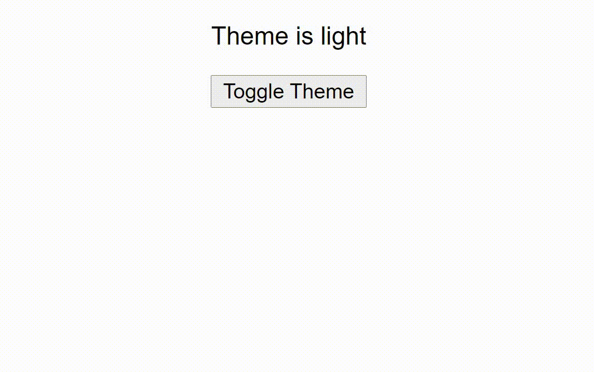

> Photo by [Frank Cone](https://www.pexels.com/photo/lightning-strike-2289940/)

Jotai is a relatively new state management library for React. It's a really simple, but make no mistakes, it's really robust

Jotai is based on the new [Recoil](https://recoiljs.org/) pattern and library by Facebook. More than half a decade ago, they created a pattern and library for state management in React called [Flux](https://facebook.github.io/flux/). On this pattern, some non-facebook devs created a new library of their own, which was even more robust, simpler to use and overall took the React world by a storm. This library is [Redux](https://redux.js.org/). You might have heard of it 😉.

Now Facebook has **Recoil**, which has different ideologies than **Flux**. Same is the case with **Jotai** and **Redux**. Let's explore some of these.

# Why Jotai?

1. **Minimalistic API** - Jotai has a very simply API design and is a joy to work with
2. **Tiny bundle size** - According to [Bundlephobia](https://bundlephobia.com/package/jotai@1.0.0), Jotai's core size minified + GZipped is just <mark>2.4KB</mark> which is crazy 🤯 (And that's when you include every single thing from the core module).
3. **Loaded to the brim** - This goes against the point above, but it ships lot of helper functions and integrations, which are **100%** optional to use, and make Dev Experience a breeze, while not being large in size.
4. **Performant** - Jotai is **BLAZING FAST**. It's runtime performance is insane!
5. **TYPESCRIPT!! 🥳🥳** - First class TypeScript Support!! Comes with Typings pre-installed, and TypeScript authoring experience is beyond heavenly.

# Ideological differences from Redux

Jotai is very very different from redux and [React Context API](https://reactjs.org/docs/context.html) in almost every way, and you might as well forget redux while using Jotai. But there's one main concept that is the catch-all, the one that you need to internalize.

Redux stores are monolithic, but Jotai is atomic.

As in, in Redux, it's a pattern to store all the needed global state in the app in one single big object. In Jotai, it is opposite. You break your state into atoms, that is, one store for one single store, or for closely related state.

# Getting started with Jotai

## Installing Jotai

```bash
npm install jotai

# Or if you're a yarn person
yarn add jotai
```

## Setting it up in the app

Jotai requires a provider to be present in the parent of the current component it is being used. The simplest way to do would be to wrap whole app in the Provider, like this 👇

```js
// index.jsx (or index.tsx)
import React from 'react';
import ReactDOM from 'react-dom';
import { App } from './App';

// Jotai provider
import { Provider } from 'jotai';

ReactDOM.render(
  <React.StrictMode>
    <Provider>
      <App />
    </Provider>
  </React.StrictMode>,
  document.getElementById('root'),
);
```

Now you can use jotai anywhere in your app!

# Basic syntax

Now that our basic setup is done, let's have a look at the basic syntax!

## Creating your first atom

~~Atoms are the building blocks of universe and clump together into mole--~~

No not that atom 😅.

Jotai atoms are small isolated pieces of state. One atom contains ideally, very small data(Though it's just a convention, you could still put all your state in one atom, thought that would be very slow).

So here's how you create your first atom 👇

```js
import { atom } from 'jotai';

const themeAtom = atom('light');
```

And that's it! You have your very first piece of state in!!

> Notice I sufficed my atom name with `Atom`, as in `themeAtom`. It's not a rule or an official convention, I simply choose to name my atoms like this, for clarity in a big project. You can name it just `theme` rather than `themeAtom` 🙂.

Now, how to use it? Well, using it is a cross between the `useState` and `useContext` hooks.

```js
import { useAtom } from 'jotai';

export const ThemeSwitcher = () => {
  const [theme, setTheme] = useAtom(themeAtom);

  return <main>{theme}</main>;
};
```

See? Exactly like `useState`, just we pass `useAtom` the atom we created. useAtom returns an array of size 2, where 1st element is a value. 2nd element is a function, to set the value of the atom, which makes all the components relying on this atom update and re-render.

So if we put it all together, the complete code would look like this 👇

```js
import { atom, useAtom } from 'jotai';

const themeAtom = atom('light');

export const ThemeSwitcher = () => {
  const [theme, setTheme] = useAtom(themeAtom);

  return <main>{theme}</main>;
};
```

And notice the `setTheme` isn't used yet. Let's change that 👇

```js
import { atom, useAtom } from 'jotai';

const themeAtom = atom('light');

export const ThemeSwitcher = () => {
  const [theme, setTheme] = useAtom(themeAtom);

  return (
    <main>
      <p>Theme is {theme}</p>

      <button onClick={() => setTheme(theme === 'light' ? 'dark' : 'light')}>Toggle Theme</button>
    </main>
  );
};
```



Check it out @ [CodeSandbox](https://codesandbox.io/s/white-glade-38c6l?file=/src/ThemeSwitcher.js)

This, my friend, is just the beginning. Jotai can do way so much more!

But this alone doesn't give much perspective. What's special about a button that toggles value 🙄? And I agree. This example is pretty boring. Let's use Jotai to make an actual theme switcher.

# Jotai In Practice: Theme Switcher hook

Theme Switching is nowadays needed in every single app, website, and heck, even blog sites(Esp blogs). And it can be quite a headache to make theme switching. First you have to set up your CSS Variables. Then you have to start with a theme Then you have to make a button that actually switches the theme. Then you have to make sure to remember the preference using `localstorage` API. But that brings you full circle to picking up the right value when the page loads, and also not messing with SSR and prerendering and...


Yeah, it's pretty complicated. A problem any developer would shiver before attempting(I did 👀).

So, that's the best kind of thing to make, and let's use Jotai to do it. You'll be astonished at how simpler Jotai can make it.

So, here are our goals.

- Works on server side(As in not referring to `document` or `window` without protection).
- Picks up locally stored value in `localstorage`.
- If no local value, tries to get the device preference, whether device theme is `light` or `dark`.
- Current `theme` should be available as a state that re-renders components it is being used in.
- Changing the state should update localstorage accordingly.

So now our list is complete, let's look at the code 👇

```js
import { atom, useAtom } from 'jotai';
import { useEffect } from 'react';

const browser = typeof window !== 'undefined';

const localValue = browser ? localStorage.getItem('theme') : 'light';
const systemTheme =
  browser && matchMedia('(prefers-color-scheme: dark)').matches ? 'dark' : 'light';

// The atom to hold the value goes here
const themeAtom = atom(localValue || systemTheme);

/** Sitewide theme */
export function useTheme() {
  const [theme, setTheme] = useAtom(themeAtom);

  useEffect(() => {
    if (!browser) return;

    localStorage.setItem('theme', theme);

    document.body.classList.remove('light', 'dark');
    document.body.classList.add(theme);
  }, [theme]);

  return [theme, setTheme];
}
```

A lot going here. So here's the breakdown.

We check whether the current code is running in browser or not. If we're running the code in SSR or prerendering, this value will be false.

We get the value stored in localstorage. If localstorage has the theme in it, then we'll consider it the highest priority, as it would be the one chosen by the user. Also, because there's no localstorage in Node, We have to fallback to default value of `light` if it's running in SSR mode.

We also retrieve the device preference using `prefers-color-scheme: dark`, in case the localstorage value doesn't exist. Again, this falls back to value `light` if device preference is `dark` or code is running in SSR.

Finally, create the atom. This will be our main store where we actually store the current theme, usable and changeable as state. Notice the value we give it: `localValue || systemTheme`. Here's what can happen with these values:

> If running in SSR/Prerendering mode, `localValue = 'light'` and `systemTheme = 'light'`, `localValue || systemTheme` will turn out to be `light`. So, important point here: Your app in SSR will be themed with light theme, so if you prerender your app, it will end up with light theme, in terms of plain HTML. As the JavaScript loads, it will sync to the most relevant theme possible.

> Why didn't I just put the `localValue` and `systemTheme` variables inside the hook? The reason: If I put them in the hook, everytime the hooks is initialized in any component, or a component re-renders, this hooks will run again, and will fetch these values again from localstorage and media queries. These are pretty fast, but localstorage is blocking, and when used a lot, can introduce jank. So we initialize these 2 vars once in the lifetime of the app, because we need these only to get the initial value.

Finally let's begin our hook:

Let's make this atom a local state using `useAtom`: `const [theme, setTheme] = useAtom(themeAtom);`. These will be our theme in the form of state. Themes can be modified using `setTheme`.

Next thing, we got the most important part of our hook that will actually make the current theme known to our CSS.

```ts
useEffect(() => {
  if (!browser) return;

  localStorage.setItem('theme', theme);

  document.body.classList.remove('light', 'dark');
  document.body.classList.add(theme);
}, [theme]);
```

It's `useEffect` that runs whenever `theme` changes, as you can see in the array in the 2nd argument. When this runs, it checks if the code is running in browser. If it isn't, it simply stops further execution by putting a `return`.

If it is successful, it goes on, and removes all the classes corresponding to out themes on `<body>`, then it adds the class corresponding to the latest value of `theme` variable.

Finally, we return the `[theme, setTheme]` pair as it is, so we can use it just like we use `useState`. You could also return these as objects `{ theme, setTheme }` giving them explicit naming.

This is it for this hook!!

And I got my TypeScript kin covered too 😉👇

```ts
import { atom, useAtom } from 'jotai';
import { useEffect } from 'react';

export type Theme = 'light' | 'dark';

const browser = typeof window !== 'undefined';

const localValue = (browser ? localStorage.getItem('theme') : 'light') as Theme;
const systemTheme: Theme =
  browser && matchMedia('(prefers-color-scheme: dark)').matches ? 'dark' : 'light';

// The atom to hold the value goes here
const themeAtom = atom<Theme>(localValue || systemTheme);

/** Sitewide theme */
export function useTheme() {
  const [theme, setTheme] = useAtom(themeAtom);

  useEffect(() => {
    if (!browser) return;

    localStorage.setItem('theme', theme);

    document.body.classList.remove('light', 'dark');
    document.body.classList.add(theme);
  }, [theme]);

  return [theme, setTheme] as const;
}
```

So this is the final code we got for switching themes robustly. This hook is simple and understandable (I hope 😅), due to the simplicity of Jotai.

But here's the thing. We haven't saved much code using Jotai, compared to using Context API. That code would be almost this simple, just have a little more boilerplate. So there really isn't much difference here.

But, here comes a twist: We can get rid of **even more** code by using something that Jotai provides: `atomWithStorage`

We can move the logic of syncing to localstorage completely, both from inside the hook as well as outside.

## Rewriting the hook with atomWithStorage

`atomWithStorage` is a special kind of atom that automatically syncs the value provided to it with `localstorage` or `sessionStorage` (Or `AsyncStorage`, if used with React Native), and picks the value up on first load automatically! It's available in the `jotai/utils` module, and adds some bytes other than the `2.4KB` of Jotai Core.

So here's how we would rewrite it:

```ts
import { useAtom } from 'jotai';
import { atomWithStorage } from 'jotai/utils';
import { useEffect } from 'react';

const browser = typeof window !== 'undefined';

// The atom to hold the value goes here
const themeAtom = atomWithStorage(
  'theme',
  browser && matchMedia('(prefers-color-scheme: dark)').matches ? 'dark' : 'light',
);

/** Sitewide theme */
export function useTheme() {
  const [theme, setTheme] = useAtom(themeAtom);

  useEffect(() => {
    if (!browser) return;

    document.body.classList.remove('light', 'dark');
    document.body.classList.add(theme);
  }, [theme]);

  return [theme, setTheme];
}
```

As you can see, we've completely got rid of `localstorage` from the code, and we have a new thing `atomWithStorage`. First argument is the key to store it in `localstorage`. As in, if you specified `theme` as value here, you would retrieve it from localstorage using `localstorage.getItem('theme')`.

As you can see, the code itself isn't much smaller in terms on lines of code. It's just 20% smaller, which isn't a big number in case of this already-small file. The main part here is that we got to hide the complexity away thanks to `atomWithStorage`. Now we don't have to keep the local value storage in mind, just have to focus on our main logic and remember that this value is synchronized locally, and that's it.

And using this hook ultimately is super simple,

```js
import { useTheme } from './use-theme';

export const ThemeSwitcher = () => {
  const [theme, setTheme] = useTheme();

  return (
    <main>
      <p>Theme is {theme}</p>

      <button onClick={() => setTheme(theme === 'light' ? 'dark' : 'light')}>Toggle Theme</button>
    </main>
  );
};
```

And it just works!! 🪄

# More about Jotai

So this was the basic intro to Jotai. I added in the `atomWithStorage` utility function to show how powerful and simple it can make your code. I will touch these utilities later on. For now, let's explore more about the basic `atom` and `useAtom` and how it gives you superpowers.

## Derived atoms

Sometimes you want to make an atom rely on another atom(s), as in you wanna compose multiple atoms together into one big computed atom. That is extremely simple with Jotai.

### Readonly atoms

Readonly atoms are derived atoms that rely on other atoms, and we can't change their values directly.

For example, these atoms' usage would be like this 👇

```js
const [derivedValue] = useAtom(derivedAtom);
```

There's no `setDerivedValue` here, no setter function. We can only read this atom. Changing the atoms it is derived from will automatically update this value.

But enough talk! Now let's see how to create these derived atom.

You have seen this atom until now 👇

```js
const store = atom('someValue');
```

But guess what, atom can take a function as a parameter 👇

```js
const store = atom((get) => get(someAtomDefinedSomewhere));
```

Here, it's function, with the first parameter named `get`. `get` is a helper function that you pass an atom to, and it gets the atom's value as a raw value that you can do operations on just like any other variable.

And you can do a hell lot more with this. For example, one simple example would be to have a list of all the keys of an object match a specific criteria to be in an array.

Here's the object

```js
export const appsStateStore = atom({
  finder: false,
  launchpad: false,
  safari: false,
  messages: false,
  mail: true,
  maps: true,
  photos: false,
  facetime: true,
  calendar: false,
});
```

Define the atom that will hold the open apps in an array 👇

```js
const openAppsStore = atom((get) => {
  const apps = get(openAppsStore); // Gives the raw value { finder: false, launchpad: false, ...

  // Filter out the values who are marked as false
  const openAppsList = Object.keys(apps).filter((appName) => apps[appName]);

  return openAppsList;
});
```

And this is it!! As you tweak the values in the `appStateStore`, setting them to `true` and `false`, the `openAppsStore` will reflect the changes and the components using this store will also be updated with new values.

You can also compose together many different atoms together 👇

```js
const xCoordinateAtom = atom(0);
const yCoordinateAtom = atom(0);

// Compose 'em all
const distanceFromOriginAtom = atom((get) =>
  Math.sqrt(get(xCoordinateAtom) ** 2 + get(yCoordinateAtom)),
);
```

You can tweak the `xCoordinateAtom` atom and `yCoordinateAtom`,and the `distanceFromOriginAtom` will update with the new values!! To me, a super math geek 🤓, this feels very magical and close to the raw math(Don't know how to explain, it just does ¯\\\_(ツ)\_/¯)

> It's a mathematical formula to calculate distance of a point from origin (0, 0). If you didn't get it, no worries, I just wanna get the point across that you can compose together different atoms seamlessly. That's it! 🙂

### Readable & Writable atoms

These are atoms that are derived from other atoms, but can also be modified on their own by the user.

```ts
const readWriteAtom = atom(
  (get) => get(priceAtom) * 2,
  (get, set, newPrice) => {
    set(priceAtom, newPrice / 2);
    // you can set as many atoms as you want at the same time
  },
);
```

This atom, when you set its value, triggers the custom `write` function we provide, and can modify the atoms it relies on. It's basically **two-way data binding**. You change `priceAtom`, this `readWriteAtom` gets updated. You update `readWriteAtom`, `priceAtom` gets updated!! Mindblowing, right 🤯🤯?!?

> Beware though: As magical as this seems, it's two-way data binding. There have been controversies in past about it, and rightfully so, as debugging and keeping the flow of data sane becomes extremely hard with these. That's why React itself has only one-way data binding. So use this atom carefully.

### Writable only atom!

These are atom that you can't read at all, these exist solely to update other atoms.

What is the point of the these? Lemme show you with an example:

Let's say we wanna update many atoms at once when some state changes. Let's assume we have these regular atoms 👇

```js
const oneAtom = atom(1);
const twoAtom = atom(2);
const threeAtom = atom(3);
```

Now in a component, let's change these all

############### TYODO 👆

# The Best of Utils

If you loved `atomWithStorage` and your head is spinning with all the possibilities it could unlock, I got many more awesome Jotai utils for you.

## atomWithDefault

Let's begin with `atomWithDefault`

## atomWithReset

## selectAtom

## freezeAtom

## splitAtom

## waitForAll

And these are only half of all utils provided by Jotai. There are so many, I'd rather write a whole book about them rather than this meager blog post that you're reading 😉. Head over to [Jotai Documentation](https://docs.pmnd.rs/jotai/api/utils) to learn about all of them
