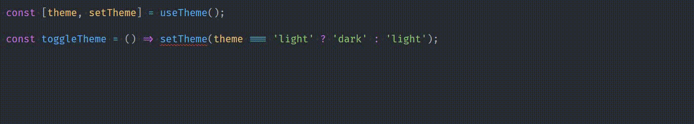

{{ series-links }}


React and TypeScript make for a mean pair. Combined, they can rule the whole world together. But sometimes, these two can get off on a tangent about some small details, and we the devs have to be the scapegoat in their battle of egos. One such problem is when we're making our own custom hooks, which return an array of a value and a function, just like `useState`.

```js
const [state, setState] = useState(null);
```

It's clearly visible that `state` is a value, and `setState` is a function. When you use this hook, everything works out fine, and these 2 have their own types on them.

But the issue happens when you're trying to make your own hook that returns an array, very similar in structure to `useState`. Let's see an example:

```js
import { useState } from 'react';

export function useTheme() {
  const [theme, setTheme] = useState('light');

  // Do epic stuff here

  // Return the 2 state variables
  return [theme, setTheme];
}
```

Here we have a `useTheme` hook, which manages our theme switching magic. Here, we declare state variables, `theme`, with its setter `useTheme`. Then we do some Web dev kung fu in using these 2 variables. Lastly we're returning an array of `[theme, setTheme]`, so we can utilise the theme and change it from anywhere. All fine.

**Until you try to use this hook 😈**

Let's say you're writing a component whose job is to switch the theme, and it uses our `useTheme` hook to do it.

You create a function to change the theme using `setTheme` exported from this hook:

```js
const [theme, setTheme] = useTheme();

const toggleTheme = () => setTheme(theme === 'light' ? 'dark' : 'light');
```

And you run into a weird error:



The error according to TypeScript is:

```txt
This expression is not callable.
Not all constituents of type 'string | Dispatch<SetStateAction<string>>' are callable.
Type 'string' has no call signatures.ts(2349)
```

That's weird. Why is that happening?

# (TLDR) Solution

Before I jump into the explanation, here's the final solution directly.

## Option 1

Make this function's return type a <mark>Tuple</mark>(See the section below for the explanation).

```ts
import { useState, useEffect } from 'react';

type TTheme = 'light' | 'dark';

export function useTheme(): [string, React.Dispatch<React.SetStateAction<string>>] {
...
```

This will return a Tuple instead of an Array, so every element will have its own separate type. The error will be resolved

## Option 2

This is the less verbose way, and I prefer this one over the 1st one.

```ts
import { useState, useEffect } from 'react';

type TTheme = 'light' | 'dark';

export function useTheme() {
  ...

  return [theme, setTheme] as const;
}
```

`as const` here might look weird, but it's perfectly valid. In this case, it makes TypeScript infer the array being returned as a `readonly` tuple. This will work perfectly.

# Explanation

If you see closely, the type of `setTheme` here is showed as

```ts
string | React.Dispatch<React.SetStateAction<string>>
```

But that's weird. We clearly know that `setTheme` is a function. If you hover over it in your editor, you can confirm it's type is `React.Dispatch<React.SetStateAction<string>>`, it doesn't have any `string` type as a constituent.

But wait, that's not it. If you hover over `theme`, it's type is the same as `setState` above.

And when you hover over `useTheme`, you find that it returns an Array of the type above 👇

```ts
(string | React.Dispatch<React.SetStateAction<string>>)[]
```


This is weird. How can we have TypeScript separate the types for each item?

Answer here is tuples.

## Tuples in TypeScript

Tuples look exactly like Arrays. Here's an Array:

```ts
[2, 'hello', true];
```

And here's a tuple:

```ts
[2, 'hello', true];
```

The difference between the two? 1st one's type, as inferred by TypeScript, is `(number | string | boolean)[]`, while second one's type inference is `[number, string, boolean]`. In the Array example, TypeScript is assigning the same type to every single item, because technically, that's the definition of an Array.

> An array is a data structure that contains a group of elements. **Typically these elements are all of the same data type, such as an integer or string.**

All are of same types. That's why TypeScript assigns same type to every single element, by combining all possible types from the array elements using union type operator(`|`).

Tuples, on the other hand, are ordered pair. That means, in the order you define the types, that's the order you enter them into a tuple. So TypeScript infers them correctly, based on the array index.

## Defining a tuple type

This is simple. Just specify the types in the order they appear.

```ts
const coordinates: [number, number] = [23.4, 43.67];
```

Simple, right :)

# Conclusion

So this is the end of this article. Hope you got something good away from it.

Signing off.

{{ series-links }}
