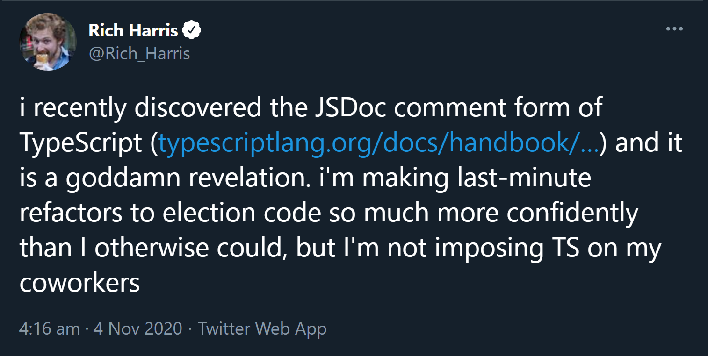

{{ series-links }}

Before starting, I wanna get this outta the way: If your reaction on reading the title was anywhere close to Hermione's 👇


Don't worry. I haven't gone crazy, and neither will you after reading this 😉

# Why is this so long? 🤔

This article is around 20 minutes long. The reason it's so long is because it delves deep into why you should consider this approach, and has explanations for a lot of broad topics.

With that out of the way, let's begin.

Lemme break it down

# Best things about TypeScript

What are the best things about TypeScript. Some things that can be listed here:

- Static type Checking
- Seamless integration with <mark>VSCode</mark>
- Futuristic. Use any syntax that isn't even in JS and TS will convert it to something backwards-compatible.
- JS files can be converted to TS files seamlessly.
- Catches silly bugs in your code.
- Strict about code.

There can be more,

# Think again!

Are all of these really the best things about TypeScript? Sure these are all really good. But the problem that comes with them is the fact that you need an additional compile step. Also, you need tooling to watch your project as the files change. That adds a boatload of configuration, dependencies, and just more and more complexity.

# Duh, just use a boilerplate 🙄

Yeah, I got it dude/tte, I can use a boilerplate from npm that will set up the right config, and all I have to do is `npm start` for watching and `npm run build` for final bundle.

But it doesn't get rid of the added complexity that is the dependencies, watch step and build step.

For modern Web App development, it's all fine. You already have a dev server running. Throwing in a few more plugins won't make much difference. And tools like [Snowpack](https://www.snowpack.dev/) and [Vite](https://vitejs.dev/) completely get rid of complexities by collapsing layers(That is, they come with all the right **batteries included**, so you don't have to do any config work yourselves. If that piqued your interest, check out this amazing article by [Shawn "swyx" Wang](https://twitter.com/swyx) about [Collapsing Layers](https://www.swyx.io/collapsing-layers/))

The problem comes when you're trying to build your own library to be published on npm. And by library here, I refer to a **non-UI library**(Not Component libraries, for example).

Why non-UI library? Because you aren't running any dev server on them by default. You have to test them everytime by reloading the page, or worse, again and again run `node index.js` if it's a NodeJS related library.

With libraries like these, if you include TypeScript in development process, there are some **heavy** drawbacks:

## Watch step

You have to keep a watcher running in one terminal, and use another one to test your code. You end up with a situation where you have 2 terminals open:


Split terminals. And good luck dealing with 2 terminal windows if your terminal doesn't split up.

## Build step

This one is probably worse than the watch step, for frontend libraries. In frontend, one of the most important thing is the bundle size you're sending to the user. The bundle size has to be kept as low as possible, so the site can load fast enough.

And this where one of TypeScript's best feature actually becomes a handicap: **TRANSPILING FOR OLDER BROWSERS**

Look at this 👇

```ts
const arr = [1, 2, 3, 4, 5];

const newArr = [...arr, 6, 7];
```

Looks simple enough. We're just trying to create a new array from an existing array and add some items to it using the <mark>Spread operator</mark>. But if your TSConfig's target is specified as less than `es2015`, you're gonna get a very weird result:

```js
'use strict';

var __spreadArrays =
  (this && this.__spreadArrays) ||
  function () {
    for (var s = 0, i = 0, il = arguments.length; i < il; i++) s += arguments[i].length;
    for (var r = Array(s), k = 0, i = 0; i < il; i++)
      for (var a = arguments[i], j = 0, jl = a.length; j < jl; j++, k++) r[k] = a[j];
    return r;
  };

var arr = [1, 2, 3, 4, 5];
var newArr = __spreadArrays(arr, [6, 7]);
```

Wohkay!! That's a tad too much. All we wanted to do was just concat an array with another. Effectively this 👇

```js
const arr = [1, 2, 3, 4, 5];

const newArr = arr.concat([6, 7]);
```

TypeScript injected a huge function for spreading purposes. Makes sense. Spread is meant to work on not just Arrays, but more structures, and has much more complexity than the simple concat function. It makes sense for TypeScript to do so.

If you're a library author, and targeting modern workflows, it doesn't make sense for all this polyfilling. The target workflow, if modern enough, would already have it's own polyfilling system, and your library sending off its own polyfills will only make things worse, due to polyfill duplication. And forget polyfilling, what if the final user is targeting modern browsers? You'll still be sending polyfills to it.

Similar is the case with using <mark>async/await</mark>:

Look at this code sample 👇

```ts
async function main() {
  const req = await fetch('url');
  const data = await req.json();

  console.log(data);
}
```

The main logic is just 2 lines. And when you compile it using TypeScript for targets before `es2017`, you get this ginormous result:

```js
'use strict';
var __awaiter =
  (this && this.__awaiter) ||
  function (thisArg, _arguments, P, generator) {
    function adopt(value) {
      return value instanceof P
        ? value
        : new P(function (resolve) {
            resolve(value);
          });
    }

    return new (P || (P = Promise))(function (resolve, reject) {
      function fulfilled(value) {
        try {
          step(generator.next(value));
        } catch (e) {
          reject(e);
        }
      }

      function rejected(value) {
        try {
          step(generator['throw'](value));
        } catch (e) {
          reject(e);
        }
      }
      function step(result) {
        result.done ? resolve(result.value) : adopt(result.value).then(fulfilled, rejected);
      }
      step((generator = generator.apply(thisArg, _arguments || [])).next());
    });
  };

function main() {
  return __awaiter(this, void 0, void 0, function* () {
    const req = yield fetch('url');
    const data = yield req.json();
    console.log(data);
  });
}
```

It creates this huge function to interop with [generators](https://developer.mozilla.org/en-US/docs/Web/JavaScript/Reference/Statements/function*). The function generated alone is <mark>1KB</mark>. 1KB mayn't be huge, but it makes all the difference for a library like Preact, which takes pride in it being only <mark>10kb</mark> minified.

This is a big problem.

> Again, this is not a problem when you're developing a Web App. It's a problem when it's a library that ships polyfills that are not needed by your project.

# Solution

What I'm gonna say will be quite radical. Stay with me for a while.

**DON'T WRITE CODE IN TYPESCRIPT FILES**

## WHAT?!?!?!

Yup. If you wanna drastically decrease the complexity in your tooling, don't write `.ts` files. **Instead use TypeScript inside your .JS files**

## You lost me there, mate!

There's a way to use TypeScript within JavaScript files. And the only tooling it requires is:

- VSCode as the editor
- ESLint extension for VSCode

That's it. And there's a very high probability that you, the reader have both of these already installed, if you're reading this blog post.

## But still, why? How credible is it?

I'll answer that with [Rich Harris](https://twitter.com/Rich_Harris/), creator of <mark>Svelte</mark> and <mark>Rollup</mark>'s tweet about this exact thing:



> [Source](https://twitter.com/Rich_Harris/status/1323758415504646144)

And let's have Preact's creator [Jason Miller's](https://twitter.com/_developit) opinion too:


> [Source](https://twitter.com/_developit/status/1323790213597061120)

With these 2 tech giants endorsing it, and me having had a good experience with this technique, I think it's credible enough.

# Using TypeScript in JavaScript files

VSCode has JSDoc built right into it.

> JSDoc is a way to document your code right in there, in comments. It was initially created to generate these huge documentation sites, but later VSCode adopted it for use in intellisense.

You can get same level of intellisense by using JSDoc as you get in directly using TypeScript

## Refresher on JSDoc

You write JSDoc like this:

```js
/**
 * Square a number
 * @param {number} a Number to be squared
 */
function square(a) {
  return a ** 2;
}
```

JSDoc starts with a double star(`/**`), not `/*`. VSCode will only recognize the comments as JSDoc if there are 2 stars.

On next line, we are describing what the function does. It's a simple description.

On the next line, `@param {number} a Number to be squared` is used to specify that the function parameter `a` is of type `number`. The text `Number to be squared` is just a description of this parameter.

Let's see it in action 👇


VSCode inferred parameter and function return type from JSDoc itself.

```ts
function square(a: number): number;
```

And you get this additional description whenever you use this function.

If you wanna type a variable rather than a parameter, that's possible too.

```js
/** @type {string} */
const name = 'Hello';
```

## Let's convert a TS program to JS

So let's take a look at this small TypeScript program. This is the same one I used in the predecessor of this blog post, [An Ode ❤ to TypeScript](https://puruvj.dev/blog/get-to-know-typescript-an-ode-to-typescript)

```ts
function sum(a: number, b: number) {
  return a + b;
}

document.querySelector('#submit').addEventListener('click', () => {
  const val1 = +(document.querySelector('#input1') as HTMLInputElement).value;
  const val2 = +(document.querySelector('#input2') as HTMLInputElement).value;

  console.log(sum(val1, val2));
});
```

So let's convert it into its JSDoc equivalent.

```js
/**
 * @param {number} a
 * @param {number} b
 */
function sum(a, b) {
  return a + b;
}

document.querySelector('#submit').addEventListener('click', () => {
  /** @type {HTMLInputElement} */
  const el1 = document.querySelector('#input1');

  /** @type {HTMLInputElement} */
  const el2 = document.querySelector('#input2');

  const val1 = el1.value;
  const val2 = el2.value;

  console.log(sum(val1, val2));
});
```

1. `sum` function is simple enough. It has two parameters of type `number`, so we use `@param {number}`

2. In TS, we can simply wrap a value in parenthesis and assert its type, like `(document.querySelector('#input1') as HTMLInputElement)`. But there's no way to do that in JSDoc. We'd have to break that value as a separate variable and type it using `@type`. Look at variable `el1` and `el2`. I have broke down these elements from the `val1` and `val2` variables, so I could type them.

3. `val1` and `val2` are simply `el1.value` and `el2.value`. VSCode's in-built TypeScript now knows its dealing with an Input element selector, so it will provide us the right autocompletion.

## Something's missing...

If you copy the above code and paste it into your own VSCode, you'll notice it'll not show any errors.

It should show errors, because unlike the original(TypeScript) version, `val1` and `val2` are not preceded by `+`, the operator to convert these values to numbers. So if these are still strings, why aren't we getting any error?

JavaScript is a very relaxed language. It will allow anything to slip by. That's its strength for a beginner, but a huge pain for an expert trying to build real apps. VSCode has to respect that lax nature for JS files, because in that case, a lot of working code will be seen as incorrect by TypeScript. So VSCode is very lax about JS files. Using JSDoc, it will provide you the intellisense, but it won't perform any hard checking.

You can do something like this 👇

```js
let data = { name: 'Puru' };

data = '😉';
```

This is a crime in TypeScript, but valid in JavaScript.

## Enable TypeScript level strict checking in JS files

You can enable strict checking in JS files by simply adding one comment at the top of the JS file

```js
// @ts-check
```

That's it. This is our signal to VSCode to bring all of TypeScript into the battle. Now your code will be type checked as if it was TypeScript itself.

But without any extra tooling/compile step 😎.

# Serious TypeScript stuff

TypeScript is much more than just `number` and `string` and `boolean`. It has interfaces, Union Types, intersection types, helper types, declarations, and just so much more. How can we take full advantage of all these robust practices, while in JS files?

Declare `d.ts` files.

## d.ts rocks!!

In case you're not familiar with them, `d.ts` are <mark>TypeScript Declaration files</mark>, and their sole purpose is to keep Declarations in them. For example, you have a function in a JS file.

```js
export function sum(a, b) {
  return a + b;
}
```

You can Type this function's parameters' types and return types inside a `d.ts` file:

```ts
export function sum(a: number, b: number): number;
```

There!! Now whenever you import and use `sum` function, you'll automatically get intellisense as if the original function was written in TypeScript itself.

But sometimes this isn't enough. Just typing the parameters and return type just isn't enough. For a great Developer Experience, you'd wanna type the internal variables of your functions too, because if even one variable is missing typing, all the other variables depending on it become useless for TypeScript.

And you also wanna use advanced TypeScript features too.

So here's a best-of-both-worlds alternative.

# Declare types in d.ts, import in JSDoc

Yup. You can import TypeScript types/interfaces from a d.ts file. Into your JSDoc. See how:

So let's say we're building an app that uses <mark>Twitter API</mark> to get data. But Twitter API response is so huge, that you can get lost in debugging errors, if you don't have a set structure of what data can come back.

So let's declare the return type of data that might come back:

```ts
export interface IncludesMedia {
  height: number;
  width: number;
  type: 'photo' | 'video' | 'animated_gif';
  url: string;
  preview_image_url: string;
  media_key: string;
}

export interface ConversationIncludes {
  media?: IncludesMedia[];
  users: User[];
}

export interface Mention {
  start: number;
  end: number;
  username: string;
}

export interface Hashtag {
  start: number;
  end: number;
  tag: string;
}

export interface EntityUrl {
  start: number;
  end: number;
  /** format: `https://t.co/[REST]` */
  url: string;
  expanded_url: string;
  /** The possibly truncated URL */
  display_url: string;
  status: number;
  title: string;
  description: string;
  unwound_url: string;
  images?: {
    url: string;
    height: number;
    width: number;
  }[];
}

export interface Attachments {
  poll_id?: string[];
  media_keys?: string[];
}

export interface User {
  username: string;
  description: string;
  profile_image_url: string;
  verified: boolean;
  location: string;
  created_at: string;
  name: string;
  protected: boolean;
  id: string;
  url?: string;
  public_metrics: {
    followers_count: number;
    following_count: number;
    tweet_count: number;
    listed_count: number;
  };
  entities?: {
    url?: {
      urls: EntityUrl[];
    };
    description?: {
      urls?: EntityUrl[];
      mentions?: Mention[];
      hashtags?: Hashtag[];
    };
  };
}

export interface ConversationResponseData {
  conversation_id: string;
  id: string;
  text: string;
  author_id: string;
  created_at: string;
  in_reply_to_user_id: string;
  public_metrics: {
    retweet_count: number;
    reply_count: number;
    like_count: number;
    quote_count: number;
  };
  entities?: {
    mentions?: Mention[];
    hashtags?: Hashtag[];
    urls?: EntityUrl[];
  };
  referenced_tweets?: {
    type: 'retweeted' | 'quoted' | 'replied_to';
    id: string;
  }[];
  attachments?: Attachments;
}

/**
 * Types from response after cleanup
 */
export interface ConversationResponse {
  data: ConversationResponseData[];
  includes: ConversationIncludes;
  meta: {
    newest_id: string;
    oldest_id: string;
    result_count: number;
  };
  errors?: any;
}
```

> These types I actually wrote, from scratch, for an open source project I work on, [Twindle](https://github.com/twindle-co/twindle). It's an awesome project, do check it out sometime.

Don't worry, you don't have to wrap your head around these types completely. Just notice 2 facts here:

1. We're declaring interfaces
2. We're exporting them all

Now we're gonna use these types directly in JSDoc.

So let's open up `index.js`, and start typing:

```js
// @ts-check

const req = await fetch('TWITTER_API_URL');

/** @type {import('./twitter.d').ConversationResponse} */
const data = await req.json();
```

What is that `import` doing in a comment, you may ask? That import works very similarly to a dynamic `import`, only difference is that here it's importing all the exported types from our declaration file, assuming that file lies in the same directory as index.js file.

Next, we're using the `ConversationResponse` interface from the imported file. Now our `data` variable has perfect types, and will offer autocompletion and errors during typing.

And all this is happening in VSCode. VSCode's built-in TypeScript is making a typings map from the comments and offering an experience similar akin to using TypeScript itself.

And the best part, VSCode will show you autocomplete for the exported types from the module you imported. What are we devs without that hot autocomplete 🤓?

# Mix n Match

You're not just limited to interfaces. You can use type aliases, classes, all imported from the d.ts file. And not just that, you can use all kinds of type helpers and operators in JSDoc.

```ts
// Partial of imported type
/** @type {Partial<import('./twitter.d').ConversationResponse>} */

// Pick types
/** @type {Pick<import('./twitter.d').ConversationResponse>, 'data' | 'includes'>} */

// Union types
/** @type {number | string} */

// Tuple types
/** @type {[[number, number], [number, number]]} */
```

And a lot more!

# Clean comments

You can keep your JSDoc `@type`s clean by not having those `import` statements everywhere. You can create a JSDoc alias for these types at the top level of your apps, and directly use them(And the autocomplete will work in recommending those too). We'll use JSDoc's `@typedef` syntax here.

> `@typedef` is used to declare complex types under a single alias. Think of it as a toned down version of `type` or `interface`.

Let's a create a `types.js` file in top level directory of project, and the code follows:

```js
/**
 * @typedef {import(../../twitter.d).ConversationResponse} ConversationResponse
 */
```

That's it. Using it is now very clean. The above code of fetching from twitter API becomes simpler:

```js
// @ts-check

const req = await fetch('TWITTER_API_URL');

/** @type {ConversationResponse} */
const data = await req.json();
```

We got entirely rid of the `import` here. Much cleaner.

And yes, **VSCode shows autocomplete for this type alias, so you don't have to remember the complete word.**

# Lastly, <mark>Generics</mark>

This topic might be the most searched for topic, because not many answers are there for using Generics in JSDoc. So let's see how to do this.

So let's say we have a generic function 👇

```ts
function getDataFromServer<T>(url: string, responseType: T): Promise<T> {
  // Do epic shit
}
```

To convert this to JSDoc, lemme introduce you to anew JSDoc thing, `@template`. We'll use this to define the generic type `T`, then use it around.

```js
/**
 * @template T
 * @param {string} url
 * @param {T} responseType
 * @returns {Promise<T>}
 */
function getDataFromServer(url, responseType) {
  // Do epic shit
}
```

This works. But there are 2 caveats.

1. `@template` is non-standard. It's not specified on JSDoc's own [documentation](https://jsdoc.app/). It's used internally in Google's <mark>Closure Compiler</mark>'s source code. Apparently VSCode supports it for now, so its not a problem for us.

2. No type Narrowing. You can't specify a generic type as `T extends Array` or something. No narrowing possible in JSDoc.

That's it folks!! Hope you got something out of it!

Signing off!!

{{ series-links }}
