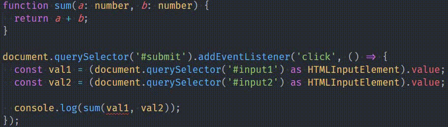
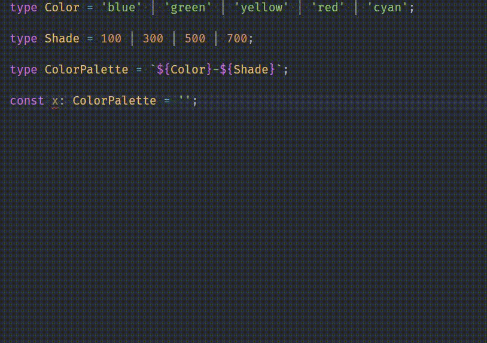
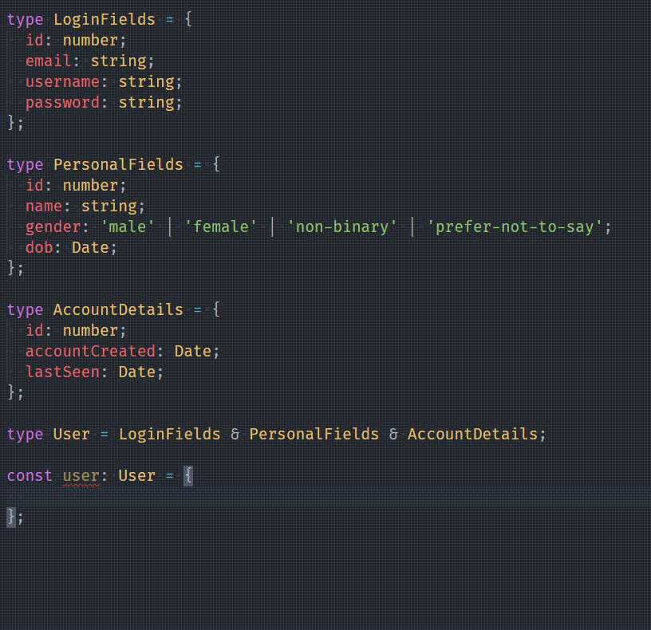
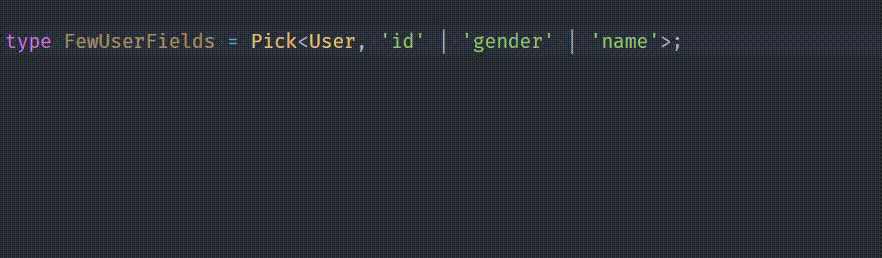
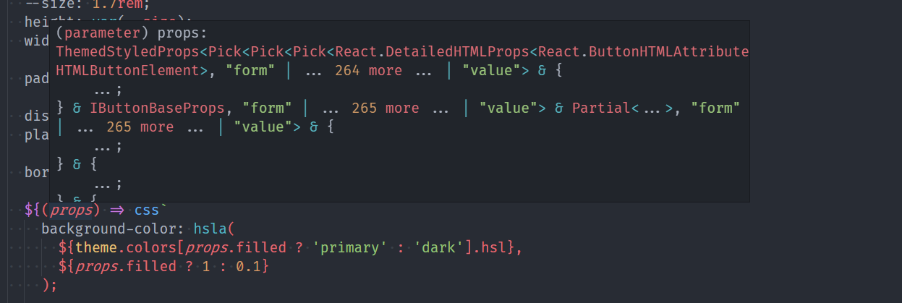

{{ series-links }}

Alrighty! So, a fair warning before you jump on to the rest of the article: This is not an extensive article about TypeScript or a Getting Started guide. It assumes you already know some TypeScript or JavaScript at least.

What I can say is that you are gonna enjoy the hell out of this article. Me being a huge fanboy about TypeScript might just make your day.

# Disclaimer

I come from a JavaScript and PHP background, so I don't have any statically typed language experience from before like C, Java, or C++. Some things that I might find great or magical about TypeScript, might be super normal or even a bit irritating if you're coming from one of these classic typed languages. This article is just a huge opinion. Opinions differ. So I implore you to just ignore that part and move on.

# What is TypeScript?

In case you aren't familiar with TypeScript, it simply adds <mark>static type checking</mark> to your code, and that's what makes all the difference in the world.

Official Definition:

> TypeScript is a superset developed and maintained by Microsoft. It is a strict syntactical superset of JavaScript and adds optional static typing to the language. TypeScript is designed for the development of large applications and transcompiles to JavaScript.

```js
function sum(a, b) {
  return a + b;
}

document.querySelector('#submit').addEventListener('click', () => {
  const val1 = document.querySelector('#input1').value;
  const val2 = document.querySelector('#input2').value;

  console.log(sum(val1, val2));
});
```

Here we have a `sum` function declared, which will take two variables and return their sum. Then we have 2 inputs where you enter numbers. Then there's a submit button, which `onclick`, gets values of these 2 inputs and pass those values to our `sum` functions, and `console.log` that value.

So let's consider this 👇


So when inputs are `2` and `8`, their sum is `28`. When values are `89` and `1`, we get `891`. Weird huh?

So here's what's happening. Instead of actually summing those numbers, javascript is actually concatenating those 2 numbers as if they are strings

```js
'2' + '8' = '28';
```

Well, this happens because `input.value` always returns a string, no matter if it is input `type="number"`.

It's easy to fix it. We just have to put a `+` sign in our values:

```js
const val1 = +document.querySelector('#input1').value;
```

> **Refresher**: If the above code seems weird to you because of adding the `+`, the reason is that `+` forces JavaScript to convert the string attached to it to a number. Why? Because +_EXPRESSION_ is interpreted as `0 +EXPRESSION`. JS tries to add 0 to the `EXPRESSION`.
>
> So let's say we entered `81` as the value, and we end up with `+'81'`. JS tries to convert `'81'` to a number. And JS succeeds at doing so. So we end up with `+81`, which is simply `81`

This `+` will convert the incoming value from the input to number, if it can, otherwise it will turn it into `NaN`. Luckily in out case, it will convert those values to `2` and `8` as numbers, respectively, and we'll get the correct answer, `10`

This saved us in the end, but what if it was a much more complex codebase, and a dev forgot to fix it, and shipped it to production? Ooh, whatever would have happened, it would make headlines in HackerNews and Twitter 😈.

This where TypeScript comes in handy. Consider the above code's equivalent in TypeScript:

```ts
function sum(a: number, b: number) {
  return a + b;
}

document.querySelector('#submit').addEventListener('click', () => {
  const val1 = (document.querySelector('#input1') as HTMLInputElement).value;
  const val2 = (document.querySelector('#input2') as HTMLInputElement).value;

  console.log(sum(val1, val2));
});
```

We added the type `number` to our parameters in `sum` function, used `as` keyword to say that the element selected is actually an `input` element. But our code editor shows an error here.



Typescript is giving us an error that we can't put a `string` where a `number` was expected. It took the guessing game out of the equation completely, and saved us a lot of time later when the we would be looking in the whole codebase for the issue.

# Only specific values allowed

You can limit the values a variable can have, using <mark>String Literal Types</mark>:

```ts
const x: 'hello' | 'hi' | 'hola' | 'namaste' = 'namaste';
```

You try to put any other value in `x`, TypeScript will throw an error, and just won't compile your code.

This feature helps a load, especially when I'm building error handling logic in React forms. I can simply make a map of all kinds of error codes and their messages, and limit it using TypeScript

```ts
type TLoginError =
  | 'user-not-found'
  | 'wrong-password'
  | 'network-request-failed'
  | 'too-many-requests';

const loginErrorMessages: { [error in TLoginError]: string } = {
  'network-request-failed': `Network request failed. Try to log in again.`,
  'user-not-found': 'Email not found in our database',
  'wrong-password': 'Email and Password do not match',
  'too-many-requests': 'Too many login attempts. Try again in a minute',
};
```

`loginErrorMessages` won't take a property other than those specified in the type `TLoginError`. I can't stress enough how important that feature was when I was building an app.

You can specify numbers also

```ts
type FontWeights = 100 | 200 | 300 | 400 | 500 | 600 | 700;

const fontWeight: FontWeights = 200;
```

Not to mention their use in limiting Arrays to accept only a small set of values.

```ts
const searchFilters: ('name' | 'email' | 'phone' | 'designation')[] = [];
```

I actually used this snippet in a search feature I built for a Dashboard app.

## Template Literal Types 💪

Think of typings for Tailwind color palette.

Let's limit ourselves to just 5 main colors, and 4 shades for the next example.

```ts
type ColorPalette =
  // Blue
  | 'blue-100'
  | 'blue-300'
  | 'blue-500'
  | 'blue-700'

  // Green
  | 'green-100'
  | 'green-300'
  | 'green-500'
  | 'green-700'

  // Yellow
  | 'yellow-100'
  | 'yellow-300'
  | 'yellow-500'
  | 'yellow-700'

  // Red
  | 'red-100'
  | 'red-300'
  | 'red-500'
  | 'red-700'

  // Cyan
  | 'cyan-100'
  | 'cyan-300'
  | 'cyan-500'
  | 'cyan-700';
```

OMG!! We already had to declare `20` different color shade types here. And this is with a limited palette. Tailwind's actual palette has `22` colors, and `10` color shades. That's a whopping <mark>220</mark> string literals. We can't define all 220 of those can we?

But we can use this nifty new feature called `Template Literal Types`. This feature shipped in TypeScript `4.1.0`, and was a total game changer when it dropped. It allowed us to apply dynamic behavior in your literal types.

See 👇

```ts
type Color = 'blue' | 'green' | 'yellow' | 'red' | 'cyan';

type Shade = 100 | 300 | 500 | 700;

type ColorPalette = `${Color}-${Shade}`;
```

Now `ColorPalette` contains all the combinations that can come from crossing all these values from these 2 types. See for yourself 👇



This here is pure magic 🦄

# Tuples FTW!

> A tuple is a collection which is ordered and unchangeable.

Tuples in TypeScript are super amazing. They help a lot when working with Arrays. Consider this

```ts
type Coordinates = [number, number];

function getLocation(coords: Coordinates) {
  const [x, y] = coords;

  /** Logic */
}
```

Now coords can only be given values that are of <mark>number</mark> type, and only **2 values**. No less than 2, no more.

Another example:

```ts
type Grid = [[number, number], [number, number]];

const x: Grid = [
  [1, 2],
  [3, 4],
]; // ✅ Correct

const y: Grid = [[1, 2], 3]; // ❌ ERROR
```

Main use of Tuples is in limiting the **types**, as well as the number of items it can take.

And the types don't have to be same, you can mix and match these as much as you wish

```ts
type UserData = [string, number, number, string, UserRole];
```

So useful!

# It is futuristic

TypeScript is always ahead of JavaScript. Every feature that comes to JavaScript, already gets implemented into TypeScript months, even years before it first shows up in JavaScript the first time.

Generally, any feature proposal in <mark>ECMAScript</mark> that reaches Stage 3 or 4, it gets implemented into TypeScript. You can start using the feature directly, and TypeScript will just polyfill it to work in browsers.

For example, look at Optional chaining. I've been using it for over a year in TypeScript before it officially dropped in Chrome.

> Refresher: Optional chaining removes the need for checking for properties in an object before using them. `x && x.y && x.y.z && x.y.z()` simply becomes `x?.y?.z.()` using Optional Chaining.

Same was the case with Classes, ES6 Proxies, Spread operator, Destructuring. You name it.

# Intersection types save effort

In MySQL, you split up related data into different tables. For example,

Instead of a single table containing all the fields

```js
| id | name | email | username | password | gender | dob | acc_created | last_seen |
```

We split it up into Many tables containing atomic data

`login_info`:

```js
| id | email | username | password |
```

`personalInfo`:

```js
| id | name | gender | dob |
```

`account_details`:

```js
| id | account_created | last_seen |
```

And then we join all these together in the query when we need all the data.

We can do a similar thing in TypeScript:

```ts
type LoginFields = {
  id: number;
  email: string;
  username: string;
  password: string;
};

type PersonalFields = {
  id: number;
  name: string;
  gender: 'male' | 'female' | 'non-binary' | 'prefer-not-to-say';
  dob: Date;
};

type AccountDetails = {
  id: number;
  accountCreated: Date;
  lastSeen: Date;
};

type User = LoginFields & PersonalFields & AccountDetails;
```

Proof it works: 

What all you can do with this is limitless. You can mix and match these types for all kinds of different requirements.

> Note: If 2 types contain same property(in this case `id`), their types must be same too, or TypeScript will error out

# I <mark>Pick</mark> you

If the heading didn't make any sense, this part is about the `Pick` helper type, which helps you pick specific properties from an interface.

Let's continue the above example only. Let's say we want to create a type with only `id`, `gender`, `name`, and these properties should match those in the original `User` type.

```ts
type FewUserFields = {
  id: number;
  gender: 'male' | 'female' | 'non-binary' | 'prefer-not-to-say';
  name: string;
};
```

Hmm. That's not good. Lots of duplication.

To prevent this duplication, we'll directly pick from the original object.

TypeScript provides a helper type <mark>Pick</mark>, which does exactly this.

```ts
type FewUserFields = Pick<User, 'id' | 'gender' | 'name'>;
```

Here's the proof 👇



See?! The fields are here, just how they were in the original object. It's so much better than duplicating. Whenever you change the these types in the original source, this type will also update itself, because it's just referencing the original one.

This type is super handy everywhere. In fact, [styled-components](https://styled-components.com/), a styling library for React uses it heavily, too heavily in fact 👇



Just see how many `Pick`s there are. If you have used this library in TypeScript, you have hands-on experience of how good styled-components with TS experience is. A lot of it is possible due to `Pick` only.

# An ode to Intellisense

And finally, the <mark>Intellisense</mark>

I know, it's kinda late talking about intellisense, considering that is the most popular and well-known feature of TypeScript. But that's why it deserves this section at the end, the most important section of any article. It's **Gratitude Time**!!

In late 2015, VSCode dropped into the Web Dev Scene. At that time, I had just got into development, around 6 months before, and been using <mark>Microsoft Webmatrix</mark> IDE (@ me on my Twitter [@puruvjdev](https://twitter.com/puruvjdev) if you remember that editor). Microsoft decided to kill it in favour of VSCode, so I installed VSCode. At the time I was primarily in PHP land, and VSCode was never near good enough as Webmatrix was at doing PHP stuff, not to mention it didn't have built-in Database manager, so I thought it was trash and moved on to other editors like <mark>Atom</mark> or <mark>Brackets</mark>(Ah! Brackets was so good 😍😍). Then I slowly moved over to more of front-end, and felt that Brackets wasn't enough for that, so I decided to move back to VSCode.

And boy, was I blown away completely 🤯

This was in mid-2016s. VSCode hadn't been there for more than 8 months at most, yet I was blown away by how good it's <mark>Intellisense</mark> was in JS files. It was butter smooth!!. It's like it would read my mind whenever I wanted to do anything. I had seen first-class autocompletion and code suggestions in <mark>Brackets</mark>, but what VSCode offered was something even more stronger.

For starters, it showed the right kind of suggestions in the right kind of files. In Brackets and Webmatrix, code suggestions were all over the place. As in, it would show me suggestions for CSS when I was writing HTML. And I wasn't in a `style` tag.

With VSCode, no problem. I would only see any CSS suggestions inside a `style` tag, and that was just as good as the intellisense in CSS files(which means insanely good).

Well, back to TypeScript. The biggest and the most impactful contribution of TypeScript I believe is in it's integration with VSCode. Most of the time, my only need for TypeScript is just its type-checking aspects. I don't want it to modify my code and apply the polyfilling magic. I just want it to catch silly errors while I'm writing the code, so I can spend my precious time catching the errors that really matter.

And that's why its integration with VSCode is so important. If it was one of those tools where the only way you can use its checking was by using the terminal only, it wouldn't take off as well. But instead, you get error reporting as you type. No extra commands, no rote memorization, nothing, nada. Just start writing, and TypeScript, your loyal friend, will guide you.

# The end

I hope you got something good out of this article. I hope this comes useful one day(by that, I mean you convincing your team to move over to TypeScript 😁).

Signing off!

{{ series-links }}
