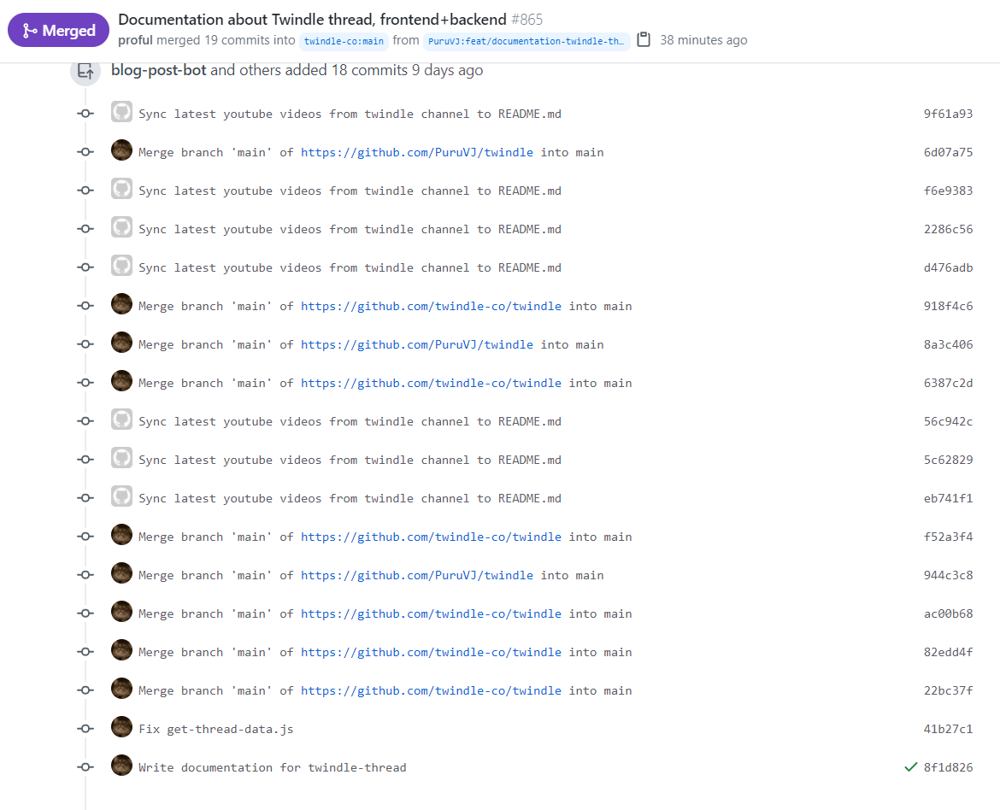

Hey awesome dev! Are you on your way to make your next contribution to a repo? Great. Awesome! 👍

But when you make your Pull Request, you suddenly see something like this below 👇



What is that?! How did it happen?!!

Don't worry. Just read on.

> Disclaimer: I'm not a git expert in any way. In fact I started using it to its full extent only 2 months back from now, in <mark>November, 2020</mark>. The explanation you read below may be (partially)incorrect, and if you find that, please inform me with a Direct Message on twitter [@puruvj](https://twitter.com/puruvj). You'll be doing a favour to the whole community. However be assured, the commands/steps below are tested to work well, and are correct.

# Explanation

It's easy to submit dirty Pull Requests with unnecessary number of commits, which shouldn't have been in there in the first place

The photo you see above is of a PR I opened recently on an open source project I'm actively working on, [Twindle](https://github.com/twindle-co/twindle). I made only 2 commits related to this PR, but as you can see, this includes a lot of commits (19 to be exact). The thing is that it was 15 commits in the previous PR, and around 13 in the one before. As you can see, these commits are just adding on. The next PR I make would have all these included plus the new commits.

There are 2 reasons why it happens:

## Making PRs from one single branch

If you keep making PRs from one single branch, whether it be a new branch you created, or it be `main` or `master`, the previous commits will keep adding up, the files involved in each ones will keep piling up too.

For example, you intended to make a PR with only 2 file changes, but your PR **may** show 10, or 20, or 30, or however number of files all those previous commits included.

## Fault in our ~~stars~~ bots

As you see in the photo above 👆, you will see some commits by a bot too. Some repos have automated bots to take care of some things. Sometimes when you merge changes from upstream repo(AKA The original repo from which you forked), some bot commits may be included, and will pollute your own commits history.

> If this explanation seems very incomplete or weird, is because of the fact that I don't know completely about these bot commits. Please do your own research about this if you can(and tell me too 😋).

# How do I get rid of these stowaway commit?

All you have to do is run these commands

```bash
git checkout main
git reset --hard upstream/main
git push --force
```

1. `git checkout main` just checkouts to your `main` branch. Replace it with `master` or whatever your default branch is.

2. `git reset --hard upstream/main` basically resets your own fork's commit history to that of the upstream's main branch. Replace `upstream/main` with `upstream/master` or `upstream/dev` or whatever that repo's default branch is, if needed.

3. `git push --force` basically pushes the new commit history to your own fork. `--force` is needed, cuz ideally, there won't be any files for git to push, so it will try to show your error.

# Caution

Hard reset may delete your local commits or any changes, so better not run this cleanup. Make your (dirty) PR, implore the maintainer to merge, and then do this process with your main branch.
