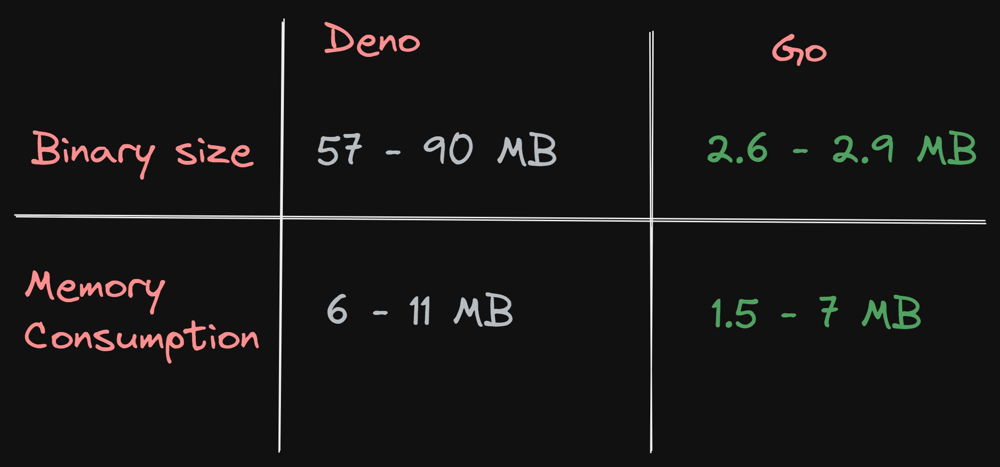

{{ series-links }}

I have been into coding since early 2015. That's about 6 years now. In that time I have done HTML CSS JavaScript, it's supersets TypeScript(My most favorite language of all time 😌) and Dart, Python as a form of timepass, and C and C++ in university curriculum.

Recently, Golang caught my eye. So I had been casually reading its documentation, the tutorial, some articles. Not really trying it out, in the sense opening VSCode and writing the code. That didn't happen.

I was just trying to get a feel for the patterns. Because the more sources you learn from, the better you become, no matter if the context is entirely different. Concepts and Patterns bleed over to other things.

Now here's one thing about me: I am a die-hard JavaScripter(That's not an official term, but who cares, let's consider it is, for now 😋). I write everything in JavaScript or TypeScript(Basically JavaScript with Types and futuristic features). Whether it's an app, or a small script or heck, even something where using Python
would be better, I still go with JavaScript.

Why? Because JavaScript is extremely flexible. As a language alone, it can literally do **anything**. It is a very simple language. There are a dozen ways to do anything in it. Then you include the **Modular** aspect of it in the equation, like [NPM](https://www.npmjs.com/), and JavaScript reaches a godly level.

Yet at the same time, it is explicit enough. You have to declare variable first before using it using `const` or `let`, unlike Python, which leads to confusion about **where** the variable is coming from!!

JavaScript uses curly braces for blocks instead of indentation. People would say Python looks cleaner without those braces, and I agree. It **looks** cleaner. But while reading, that indentation confuses me, as in, the line I'm reading belongs to which block exactly. Plus writing it is really risky. You might end up accidentally removing indentation from a line at the end of a block and it becomes a part of the outer block. It **has happened to me**, countless times.

These are some reasons why JavaScript is my favorite. So where does Go factor in on it?

Let's see!

# TLDR

Sorry, there's no TLDR for this article. It's just a documentation of my experience 🥲.

# Disclaimer

Before we start, here's something I wanna make clear: This isn't an organized technical article about pros and cons of Go or JavaScript. This is a completely Subjective article about what **I like** about Go and what I don't like about it.

If yur here for a hardcore, informative article about Go and JavaScript, I might disappoint you 😅.

But hey, if you wanna read first hand experience, this is it!! Read on!! 🤩

So with that out of the way, let's begin!

# Why even try Go?

This is a valid question. You saw I know many languages, and even on top of that, I use JavaScript for everything. So what gives? Why try to fit another language in my tiny brain?

The problem was when JS was way too big!!

What do I mean by that? Let's rewind a little!!

# The lazy undergraduate

> Spoiler: I am the lazy undergraduate in question 😄.

I took admission in university a few months back. Thanks to Covid-19, our classes are fully online. It means there are a bunch of Google meet links that I had to hunt for, for every class.

So the actual process was:

1. Open up the timetable every hour and see which class is next.
2. If there's a class in next hour, find out its link.

Believe me or not, this process took 5 minutes. EVERY. SINGLE. TIME! 5 minutes isn't a lot, but you count these 5 minutes for every time I had to it, and combine it, that's around 10+ hours wasted just for finding the link.

And worse than that is the repetition. As a programmer, you know how horrible it is do the same boring task again and again. And unlike non-programmers, you can't accept the situation and get used to it. You have to automate it, even if it takes hours.


So hey, that's what I did!!

I created a script that would run in the background, and open the class link in the browser 5 minutes before the class started. Just like that!!

# In comes Deno


If you're like, "Hold up a minute, what's Deno doing an article about Go?", lemme explain.

Deno is platform for JavaScript/typeScript, like NodeJS, with the added benefit of compiling your code into machine level code, or an executable file.

This was perfect for me. I could write code in my favorite language, and convert it over to an executable that I could configure to run on System startup, so I'd never have to run it myself ever again.


Only it wasn't perfect 🤐🤐

The code itself was amazingly easy to write. I completed it in 3 hours, because I was so familiar with TypeScript.

But where the issue was while compiling the code into an executable.

The executable's size was <mark>56 MB</mark> for windows, and as high as <mark>90MB</mark> for MacOS M1.

56MB isn't a lot for me. Even 90 MB is nothing. But it kept nagging at me. I try to keep the sizes of apps/websites as low as I can, and 56MB felt just way too big for that.

And not only that. Because I had made this project public(Here it is: [PuruVJ/auto-class-launcher-deno](https://github.com/PuruVJ/auto-class-launcher-deno)) and usable for everyone, my batchmates tried to use it, and well, 60-90Mb was way too big for them, due to limited internet and all.

So I got a good excuse to re-write it.

Node was out of question because any script in it would require NodeJS to be installed on the system and overall a more complicated process.

I turned towards Rust! I had been jumping to learn Rust for quite some time, cuz of its performance and modernity and all that stuff.

But oh boy, Rust was hard. Extremely hard!! I gave up after a few hours.

Then, I finally turned towards Go!!

# Learning Go

I sat down at night to make it. I created the project, initialized the Go boilerplate(which is just a `go.mod` file and a `main.go` with 4 lines of code), **then** I opened up the Go Tutorial.

Yeah, this might seem strange to you. Initialize a project, and **then** start learning that thing? Why would you do that??

Well, I'm a huge proponent of <mark>Learning by Doing</mark>, where you learn the bare minimum upfront, and the rest you learn by trying to make a small project in it. It makes you learn the thing the hard way, but really fast, without wasting any time on trivialities.

In case of Go, though, I didn't need anything upfront, cuz I had seen the syntax before a bit and it looked simple enough to me.

> Spoiler: Learning by Doing really works, I learnt basic Go in 3-4 hours only 😉

# Results

Before I jump into the experience, here's the straight up results 👇



> If you're unable to read the image(Screenreader/Slow network), it's a comparison table showing Deno generated binary size to be **57 - 90MB** and memory consumption to be **6 - 11MB**, whereas with Go, the binary size is **2.6 - 2.9MB**, and RAM consumption is **1.5 - 7MB**.

Mindblown right 🤯?! Such a huge difference in the binary size. The Go version is straight away **22 - 31** times smaller!!

And even the **max** memory consumption of Go binary is similar to the **minimum** memory consumption of the **Deno** program.

> The reason the memory consumptions varies is because both these platforms are Garbage Collected, so the objects and constructs are garbage collected **eventually** and memory consumption drops down, because the binary knows it need not keep those things in memory anymore.

# Observations about migrating

This, folks, is the part you came to read about actually!! Read on!!

So I migrated the whole app to Go, (mostly) bug free, in 1 day.

And here's my observations, as an avid JavaScripter learning Go for the very first time!!

## It isn't much different (Positively 🙂)!!

Really, that's the first point I noticed about it. It isn't much different from JavaScript. There are variables, functions, `if`, `else`, `for`, `switch` blocks, Error handling system and what not.

That is the main point of Go, really!! It combines all the knowledge of 60 years of programming into a very simple language which doesn't invent a lot of new stuff. Rather, it focuses on problems that aren't even code related, which are just as important as the code itself, like feature creep, standard formatting, great package management system and stuff that isn't answered well enough in a majority of languages to the day.

OFC, it depends on how comfortable you're with programming languages, generally, but if you're very comfortable with TypeScript or Dart or any other statically typed language, you'll feel right at home with Go.

But even then, it isn't necessary to know a Statically typed language before, as Go will infer as much of the types as it can without you needing to tell it much.

## Variables are Pythonic, but not quite...

Here's how JavaScript variables are defined.

```js
// Declare variable
let someVal;
someVal = 'hello';

// Set it to something later on
someVal = 'world';
```

If you wanna do it explicitly in TypeScript,

```ts
let someVal: string;
someVal = 'hello';

// Set it to something later on
someVal = 'world';
```

OFC, TypeScript is intelligent and you don't always need to specify types for a variable.

As you can see, it's **extremely clear** where this variable is defined. You are scrolling through a file, there's the big `const` and `let` glaring right at you. The source is extremely clear.

Now let's come to Python.

The above example of declaring a variable here 👇

```py
someVal = 'hello'

# Set it to something later on
someVal = 'world'
```

Can you the declaration part and the part where we set it's value to something, later on in the program? There's no difference. No way to know where this variable was defined.

It's irritating in my opinion. There needs to be some distinction between the two!!

Now, why I talk about Python variables? Cuz Golang variables, in their simplest form, are very much like Python variables, but they have one extra character that prevents the confusion that Python variables introduce. That character is `:`

```go
someVal := "hello"

// Set it to something later on
someVal = "Hello"
```

1st time, I'm declaring the variable using the `:=` operator. But when setting its value later in the program, I use the regular `=` operator.

This is a small thing, but it makes a huge difference!! I even actually prefer it over JavaScript's `let` variable declaration. It is cleaner, but not **so clean** it sacrifices developer ergonomics.

And if you prefer a more verbose way, that's there too

```go
var someVal string = "hello"
```

Just like JavaScript's `var someVal = "hello"`, but here the data type is necessary. If you're a TypeScripter, you'll feel right at home here.

And ofc, you also have `const` in go, and its declaration is the exact same as doing it in JavaScript

```go
const someVal = "hello"
```

I really love the fact that Go goes the extra length to keep the code clean, but doesn't shy away from providing the standard, more verbose APIs when they're needed. It's the best of both worlds.

## Type System

Go's Type system is similar to the type system of TypeScript, where most of the time, you don't even need to specify types for your variables.

In TypeScript, this below:

```ts
const x = 'hello';
```

is inferred as `string` automatically. Same with number or boolean or just anything.

Go works like this too!!

```go
x := "hello"
```

is inferred as `string`. Works similar to TypeScript!!

This kind of type system is personally my favorite!! Having too much type information makes the code hard to scan, in my opinion!

Having types only where absolutely needed is the way I roll, and I am glad Go has that same philosophy 🤩

OFC, there was one place where I found Go's system to be less convenient.

You see, in the project, I input the timetable and link information from an external `.json` file. That JSON file has the following TypeScript structure 👇

```ts
type ClassConfig = {
  link?: string;
  times: {
    day: 'mon' | 'tue' | 'wed' | 'thu' | 'fri' | 'sat' | 'sun';
    time: string;
  }[];
}[];
```

As you can see, I have an object type inside the main object type. If you're a TypeScript developer, you wouldn't even think about it twice.

But in Golang, you can't define a type with a struct inside struct 🤐

So I had to do this

```go
type ClassTime struct {
	Day  string `json:"day,omitempty"`
	Time string `json:"time,omitempty"`
}

type Class struct {
	Link  string      `json:"link,omitempty"`
	Times []ClassTime `json:"times"`
}

type ClassConfig map[string]Class
```

So yeah, I had to declare 2 more types to get the TypeScript behavior 🥲.

> Those tags in structs are a way to tell go to expect this data to be a json field, and don't include a field if it is not there in the JSON itself.

## Standard library is the 🧑‍🍳😘

> Bonus points if you figured out the heading 😜

JavaScript doesn't have a standard library. Sure, it has some really good global functions that you can snatch up and use directly, but they don't qualify as **standard lib**.

Go is the opposite. By default, globally, it doesn't provide much.

But you start importing stuff from the built in standard library, you can achieve a lot!!

Want JSON? Import `json` package, and use it.

Need to do math? Import `math` package, and use it!!

But you're wondering, doesn't that add an extra step over just using the `Math.*` and `JSON.*` objects of JavaScript? Yes, it does!

But that doesn't mean the Go is bad for not having global objects like these, or JS is bad for having global objects that are just lying around in the namespace. No.

Go is a compiled language. It takes all the code you wrote, inlines everything you imported, and then convert it to machine level code. JS on the other hand is an interpreted language. What you write is what is executed in the browser ultimately, no conversion required. So there, having these objects available isn't a big problem.

But in Go, if you include every in-built module by default, it's final output size is gonna be **huge**. No one likes huge file sizes. So by importing only what you need, output size stays small.

And the standard library has just so much more stuff than `Math` and `json` packages. It has packages that in Node/Deno world, you'd be installing from npm/pulling it with a URL.

Here are some great libs 👇

- **bytes** - Dealing with Byte slices
- **context** - Defines the Context type, which carries deadlines, cancellation signals, and other request-scoped values across API boundaries and between processes.
- **database** - Interfaces for dealing with Databases(SQL only, at the moment)
- **embed** - For embedding resources into your final binary so no need to ship many different files
- **time** - For dealing with dates and times.
- **flag** - Package flag implements command-line flag parsing. This is really shocking to me IMO, cuz in Node and Deno, you always have to pull in another library for dealing with CLIs. And here, you're getting that literally built-in 😻

There's so much more great stuff in Go Standard Library!! I highly recommend you to check it out.

## go:embed is DOPE!! 🤯🤯

While building this script, I had a little hiccup: _How to store a default timetable config in the binary itself? 🤔_

In Deno, I had directly inlined the config inside a .ts file as a simple JS Object. But I didn't want to do it, as declaring nested objects in Go is more work. You have to specify object with their struct type next to them everytime. Overall, didn't feel like a good idea ultimately.

`go:embed` comes to rescue!!

Rather than explaining what it does, I'll just show you 👇

```go
import (
  _ "embed"
)

//go:embed sample.json
var sampleConfigStr []byte
```

See the comment `//go:embed sample.json`? This is all we need actually! With this, Go will get this file, and embed it in the variables defined on the next line. Here I have specified the variable to be a `Byte array`, but it could've been a `string` too. And it would **just work** 🤩

I ship the `sample.json` file, which is the default timetable now, directly in the binary. No need to download the timetable separately.

## Go extension for VSCode is a gem

Did I mention how marvelous Go's VSCode extension is 😍?!

It provides blazing fast intellisense.

It allows you to auto import packages from standard library while typing. So if you're typing `fmt.`, and `fmt` hasn't been imported, it will show you the methods available on `fmt`, and when you use the autocomplete to type out the method, it will automatically import that package for you!! No need to go to the top of the file and add the package to the `import` list. This feature is really good.

It creates tests for your functions automatically. Just right click inside the function, and click on `Generate tests`, and bam!! You have a tests file now!!

And, remember the Class definitions above?

```go
type ClassTime struct {
	Day  string `json:"day,omitempty"`
	Time string `json:"time,omitempty"`
}

type Class struct {
	Link  string      `json:"link,omitempty"`
	Times []ClassTime `json:"times"`
}

type ClassConfig map[string]Class
```

Notice all these `json:` tags in the definitions. These were added by the extension, not me. I struggled to add these myself for some time, but it didn't work, cuz I was adding spaces here and there, but you aren't supposed to add those. So I put the cursor in the struct definition, right click -> Add tags to struct field. It added these tags and the code worked finally.

There's a lot more this extension does. It's extremely well crafted, so much so that after you go back to a TypeScript project after this, you actually start feeling homesick(extensionsick?) for this extension. And that's saying a lot, cuz TypeScript tools in VSCode is on a **godly** level.

## No .map .filter .every 😭

All these were the good parts of Go. But there are some things in Go that I didn't like as a JavaScripter. People may argue that Go is better for it, but that doesn't mean I have to like it.

Which leads to this point: Go doesn't have `arr.map`, `.filter`, and all the superb array methods that exist on arrays in JS. Which means I have to use loops for everything.

Loops aren't bad, but after using these Array methods for so long, using loops feels like going back to the stone age 🤧

## Heartsick for the +

This is a **super nitpick** and I might as well not include it in this post, but I might as well just do 😉.

In JS, you have this little trick to convert any data type to a number, by just putting a `+` symbol before it.

```js
+'hello'; // NaN
+'11.5'; // 11.5

+true; // 1
+false; //1
```

This trick is very useful in JS. Sadly, Go doesn't have this, you have to use `strconv.atoi` function, which you can't use in value, as it returns a tuple of value and error, so you need an extra line

```go
hours, _ := strconv.Atoi(timeArr[0])
```

This isn't much more code, but nothing beats `+timeArr[0]` 😌

## Reinvent the module system please 🙏

This was probably the most painful aspect. In JS, you write some reusable code in another file than your main file, say `math.js`.

In `math.js` you can export the functions you need 👇

```js
export function square(a) {
  return a ** 2;
}
```

And then import it when you need to use.

Go also has ways to import and export from other packages, but that's it. Import and export from packages, not other files. Other files in your project with the same `package <name>` specified in them have everything shared among them, which, in my humble opinion, is not good. Globals was a **huge** problem in JavaScript world, and that's the reason we have modules now in JS(After 10 years od people making their own module systems. Yup, the problem was **that** big).

Now, I have a feeling file based module system probably won't come to Go anytime soon, but still, if you can do it Golang folks... 🥲

# Final words

Don't let the last few sections make you shy away from trying Go, moving to Go was a very positive result ultimately, and I'd recommend every single JS developer to try Go.

Hope this article brought you some enthusiasm for trying Go, and some newfound respect for JS(Necessary once in a while thanks to Tech twitter 🙄)

Peace ✌️
