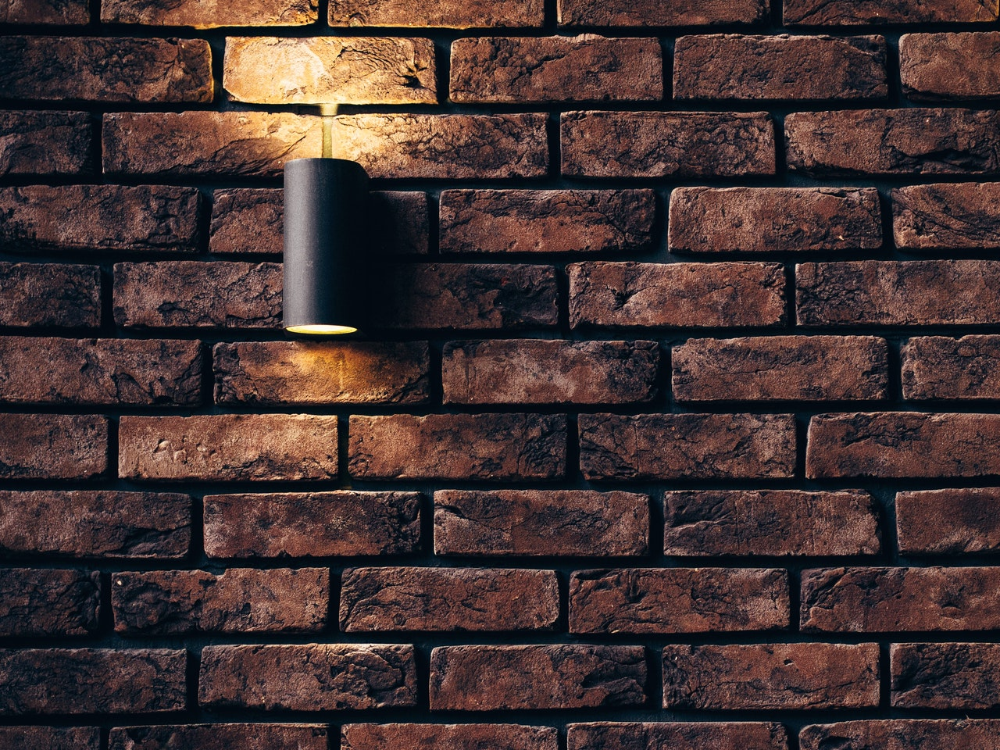

{{ series-links }}

Hi! In this blog post, I delve deep into the design part of how I created my personal website. I won't be going into the code. Feel free to look into my [Github Repo](https://github.com/puruvj/puruvjdev) for the the code.

# Why

Why the need for a personal website? Well, why not?

Having a personal site with a blog can take you very far as developer. Not only does your online presence increases, but writing a blog regularly can increase your mind's clarity as a developer in the long run.

Plus it allows you to show off your programming and design skills! What better excuse than that?

# Requirements

## Looks good.

This one is a no-brainer. If you have an ugly blog, you yourself wouldn't wan't to look at it.

But this is not it.

Looking good means that it should be aesthetically pleasing too. To make something aesthetically pleasing doesn't just require a good eye, it also calls for some knowledge of proportions.

It should be minimalistic.

And most of all, it must a conscious design. I will later elaborate what I mean by this.

## Blazing Fast

> A fast site is a good site. A slow site is no site.
>
> ~ Me 😁

No, literally. No one's gonna wait 2 minutes for your blog post to show up. They'll <s>definitely</s> probably leave your site. Plus you'll be doing your users with expensive data plans a big favour (Can tell from experience).

Everyone loves a site that loads instantly.

## Prerendered

For the posts to show up as social media cards and be fast, they need to be prerendered, meaning that each route must be already rendered at build time and converted into a index.html file

## PWA

The site should be PWA aka [Progressive Web App](https://web.dev/what-are-pwas/). If you aren't familiar with these, in simple words, a PWA means just a web app that is enhanced and can be added to home screen and it will behave just like a native app.

A personal site doesn't really needs to be installable to home screen, but those who really likes reading your blog will probably want to add your blog to their home screen.

# Tech Stack

So the stack I decided to use for this site is:

- [StencilJS](https://stenciljs.com) as the framework
- [Vercel(formerly Zeit)](https://vercel.com) for the hosting
- [ShikiJS](https://github.com/octref/shiki) for code syntax highlighting at build-time.
- No design library! I designed everything from scratch. No bootstrap, no Materialize, nothing, nada!

> NOTE!!: I've moved my blog over from StencilJS to Svelte. This isn't to say StencilJS is a wrong choice to build blogs or apps. It's just I had too much free time on my hand 😅

## Why not Gatsby/Next with React

Right now (at the time of writing, in 2020), [Gatsby](https://www.gatsbyjs.org/) and [NextJS](https://nextjs.org/) are the hottest meta-frameworks for building fast and prerendered sites, especially blogs. One of my most favourite personal website is [joshwcomeau.com](https://joshwcomeau.com/) by [Josh Comeau](https://twitter.com/JoshWComeau), and it is built with Gatsby. Next is just as performant. Plus there's the benefit that it's React.

There also Static Site Generators like [11ty](https://www.11ty.dev/), [Hugo](https://gohugo.io/) and [Jekyll](https://jekyllrb.com/), which produce a completely static site. These produce sites even faster than Gatsby and Next.

Then why not any of these? Why Stencil?

**First**, Stencil is like a first language to me, in terms of framework experience. It's very well written and very similar to both Angular and React, the only difference being it's 100% Vanilla JS. Simple and standard `fetch` for me(which I totally love) instead of a bloated `HttpService` or `Axios`.

**Secondly**, It is very damn performant and tiny. The Stencil **Hello World** app is just <mark>87 bytes</mark>. Not 87 kilobites, 87 <mark>bytes</mark>. Yes that's how small it is. And it uses Preact's virtual DOM, meaning its runtime performance is just top-notch. Next and Gatsby, pull in React in the end, which is <mark>200+kb</mark>. That's just too much for a simple blog.

**Thirdly**, Prerendering. Stencil `v1.13` came with the robust feature of Static Site Generation. Meaning all the routes will be prerendered at build-time and converted to plain HTML, making the site blazing fast, cuz the content can be shown even without any JS loading. I don't opt-in for 100% Static though.

**Fourthly(If that's a word :thinking: )**, I still need interactivity and image lazyloading on the site, so disabling JS all-together is not an option. That's why Hugo or 11ty or Jekyll are out of question.

# Design Choices

## Color Palette

There is a running joke in our industry that it takes 1 day to design the layout of site, but a whole week to just get the color palette right.

It's a little exaggerated, but kinda true. Choosing a color palette is quite difficult, for most designers.

So after 3 hours, I found a perfect color palette. Mostly white background(Duh! 🙄) with the primary color <mark>#6002ee</mark>. This for **light mode**.

For **dark mode**, the background is **#222428**(which is also the text color in light mode) and <mark>#714cfe</mark>.

A secondary color wasn't required, as my site is quite minimalistic.

## Fonts

Remember that joke about color palette I just mentioned? Well it applies to selecting fonts too. So after 1 more hour 😅, I found the best fonts(Note that I changed one font after I had launched the site).

- **Comfortaa** for headings
- **Quicksand** for blog body
- **JetBrains Mono** for code snippets, blockquote, and navbar (It's also my IDE's font)

These are all available on Google Fonts. I have an article about [performantly loading Google Fonts respecting user's data saver settings](/blog/google-fonts-prefetch) too. Check it out.

# Finally designing site

Writing about how to design a website is like writing about how to create a painting. It's too abstract and subjective. You have to get your hands dirty. No other way to get better at designing.

But I can drop in a few things that I did.

## Keep it minimalistic

A minimalistic design can do wonder for your design. When done right, it looks really great. It sets your brand apart by focusing on the important areas more. Not only that, a minimalist design puts the user in control. If they can easily scan a website, they won't be scared by it, meaning that they will come back. What more can you want.

Check out this great article about minimalistic design:
[7 pillars of minimalist Web design](https://thenextweb.com/dd/2015/06/09/7-pillars-of-minimalist-web-design/)

## Use the golden ratio


This one sounds the weirdest of all. What the hell is Golden Ratio? It's a lot of things in nature and is responsible for a lot of artichectural choices. But for a designer, it means that your site will look aesthetically pleasing. Why?

Golden Ratio is a number: `1.618`. Why is this number important? It is found throughout the nature and day-to-day life. Our eyes find things following this number aesthetically pleasing. Our bodies' own geometry is built heavily on it. Our screens and TVs even follow it very closely. `16:9` and `16:10` screens are a very good example.

Golden ratio is such a vast topic that I can't write everything about it here, but I'll show you where I'm using it. Look closely at this blog post you're reading on my site. The ratio of width of screen to the width of reading area is `1.618`. Meaning I just set the reading area's width to `61.8%`(`1 / 1.618 = 0.618`).

And nope, I'm not kidding.

```markdown
1 / Golden ratio = Golden Ratio - 1
```

I love Math and try to put meaningful numbers in my designs. You don't have to be that. But there is tons of research about aesthetic implications of Golden Ratio. It's even taught in architechture. Heck, even Twitter used it in their previous design. I suggest you to take a look.

Here's an article about [using Golden Ratio in web design](https://uxplanet.org/golden-ratio-bring-balance-in-ui-design-765c954f0ff9).

## Use animations

Use animations, like fade-in/out on page transitions, like I'm using here. In nature, nothing ever happens suddenly, there's always a transition.

Transitions and animations can increase the emotional appeal of a site. They elevate the User Experience. If your site can make users feel good, their chances of coming back increases a lot. This is why companies like Google and Apple focus so much on good animations. This is why that amazing G-Mail animation exists.

## Style Scrollbars

Styling scrollbars is very easy. You just have to copy the code from StackOverflow and edit it(Cuz honestly, who can remember all those huge selectors 😏).

Scrollbars as-of-now are editable only in Webkit based browsers, meaning Chromium-based browsers(Chrome, Brave, Edgium, Opera) and Safari only. Firefox, IE and legacy Edge don't support styling of scrollbars.

> In my opinion, Firefox is not an issue. Their scrollbars look dope as hell 😎

Scrollbars occupy very little real-estate on a page, but when done correctly, can take the look, authenticity and integrity of your site to the next level. A well designed site with default scrollbars just don't do it for anyone, whereas those slick curved transparent scrollbars just do it for everyone.

## Use what is good for you

Fixed top-bars have been the most popular mode of navigation on Desktops since the inception of web itself. However in my opinion, a site with a text-heavy page would benefit more from _not-having_ a top bar.

Lemme explain. When you're reading, you're scrolling vertically. Desktops are wider than they're tall. So our minds sees it as contracted. Top bars reduces the amount of readable space even further, contracting it even further. And some sites have very big nav bars, which reduces readable space considerably.

This make our subconscious mind relate that site with closeness and suffocation. No one likes small and suffocated spaces.

Rather, use a sidebar. And a narrow one if possible. Like this blog you're reading.

> If you're reading this right now, you'll notice that this blog **does not** have a sidebar, rather a narrow topbar. I've moved over from sidebar to topbar, simply because the topbar looks better for my own blog and allows the theme switcher to be placed there too.
>
> That doesn't mean a sidebar isn't a good UI pattern. It's still very good, for it provides users with more area to read. However a narrow and undistracting top bar isn't a bad choice either

{{ series-links }}
