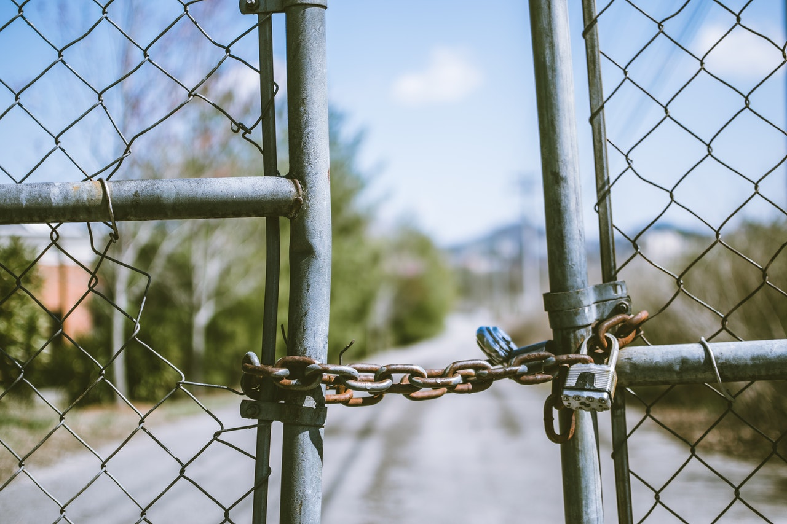

I'm sure you have added `<a href="..." target="_blank">` to your website before or at least know about it. Well, do you know that it has a potential of crashing your site and even have your user robbed?

Just kidding. I exaggerated a bit there. But seriously, this is a security issue that can be exploited. And it really affects performance, too.

When you click a link with `target="_blank"`, the link opens up in new tab. As usual, nothing much happens. But under the hood, <mark>some of the most important properties</mark> of your page's `window` object get passed to the **page that is going to open** in the `window.opener` property.

One of these properties is the `location` prop.

With the `window.opener` property, the new page can redirect the page from which it was opened to some other page. An e-banking site `icici.com` can be redirected to `1c1c1.com`, and the user will almost always miss this transition. Watch this video I have here to get a feel.

<video controls>
  <source src="/media/link-noopener.mp4" type="video/mp4"></source>
</video>

A bit scary, huh?

And there is also the issue of <mark>performance</mark>. The page that opens up runs on the same process as your page, meaning that both pages can become slow and laggy, just because of the other page. Don't link Youtube like this.

# Solution

Just add this little attribute to your link:

```html
rel="noopener"
```

Yup, this little attribute solves all of the above problems. An example of this would be:

```html
<a href="https://twitter.com/puruvjdev" target="_blank" rel="noopener"></a>
```

This is a small measure, but it can pay off really well. Every external link on this blog, for example, has this attribute to it. Check it out if you want to.

[Read more about it here](https://web.dev/external-anchors-use-rel-noopener/)

_That's it for today. Hope you liked the article. Ping me on Twitter if you have any problems or simply leave a review. Link is in the footer._
