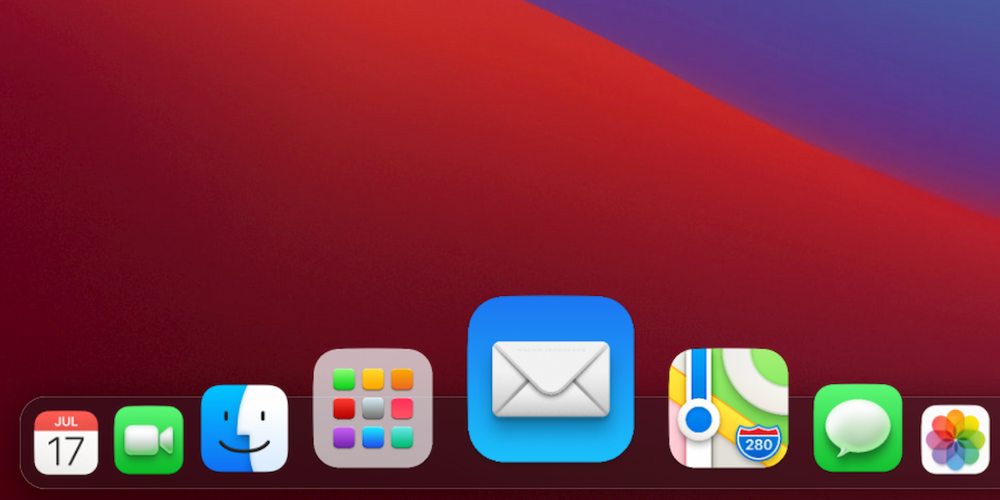
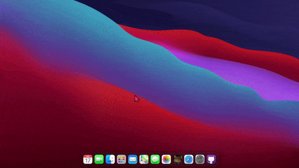
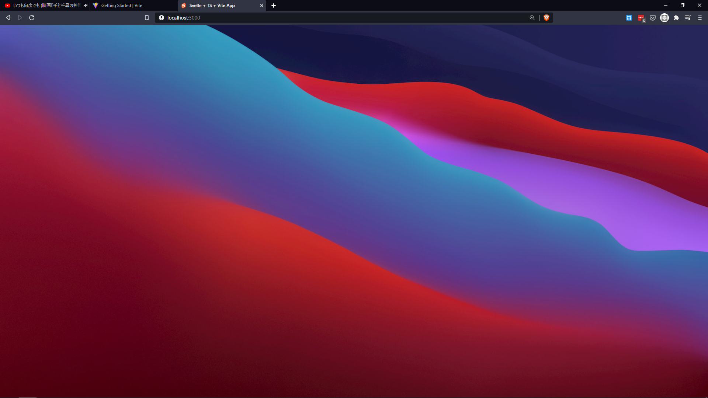
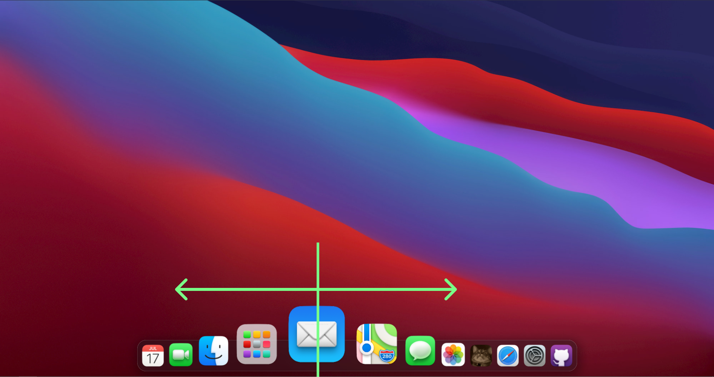

macOS Dock, when you hover over it, has such a good feedback animation. The current icon your cursor is over becomes big, and the nearby icons become bigger too, but as you move your cursor, the icons' size changes based on distance from your cursor, kinda like this below 👇



Pardon the bad quality 😁. Pretty slick, right? So interactive, so playful, its just freaking good 😍

But here's a twist. **That isn't macOS**. There are no tooltips, no desktop icons, even the animation looks bouncier.

Ladies and Gentlemen, what you see above is the final product we're gonna make in this blog post using Svelte. **In less than 100 lines of logic 😎**

## That looks way too good for just 100 lines 🧐🧐

I know!! That's the beauty of Svelte 😌

Don't believe me? You can check it out right here: [Demo](https://macos-web-svelte-dock-puruvj.vercel.app/). \
And here's the original source code @ Github: [Source](https://github.com/PuruVJ/macos-web-svelte-dock)

Feel free to read the source code directly, if you feel like you can understand what is going on just from reading the source. And if you can't, no problem, that's what this article is for 😎

Let's dive into it!!

# Tech Stack

Here's what the tech stack is gonna be for this little demo:

- Svelte
- popmotion library
- Typescript 4
- Vite

## What's with Vite? 🤔

Vite is the new cool kid in the block 😎. Its basically a bundler and dev server like Webpack(With the Dev Server plugin), only it comes with everything pre-built and pre-configured, so you can jump into the code directly.

It won't change how we write the code, only the way we refer to our assets changes a bit, so you don't have to worry about it much.

## Popmotion?

Yeah, this is an animation library on which the utterly awesome <mark>Framer Motion</mark> library is build. We don't really need the animation related stuff from this library, only a small helper function that is essential for this demo. Install it beforehand

```bash
npm i popmotion
```

Or if you're a `Yarn` person

```bash
yarn add popmotion
```

# Preliminary setup

Our demo won't look good without that slick background and the great CSS everywhere. So let's set up the basic shell of our application.

So let's start with the root component.

```html
<!-- App.svelte -->

<script>
  import Dock from './lib/Dock.svelte';
</script>

<main>
  <Dock />
</main>

<style>
  main {
    max-width: 100vw;
    height: 100vh;

    background: url('/wallpaper.jpg');
    background-size: cover;
    background-position: center center;
  }
</style>
```

Let's break it down

1. We're importing the `Dock` component. It's not declared yet, so there will be red squiggles in there. We'll declare it in a moment.

2. We have a `main` tag enclosing the `Dock` element.

3. We have our styles here. These are simply set so that the beautiful macOS Big Sur wallpaper takes up all the space and adjusts to different viewport sizes gracefully.

So we end with this beautiful view 👇



> Notice we're referencing `wallpaper.jpg` as if its next to our current file, but it isn't. It's inside Vite's `public` folder. You can refer to those files as if you're current component in inside the `public` folder. This holds for `<link>`, ``, `<a>` tags and what not. Go crazy 🤪!

# The Dock

So let's set up the actual `Dock.svelte` component.

Here it is 👇

```html
<script lang="ts">
  import DockItem from './DockItem.svelte';

  const apps: string[] = [
    'calendar',
    'facetime',
    'finder',
    'launchpad',
    'mail',
    'maps',
    'messages',
    'photos',
    'scared-cat',
    'safari',
    'system-preferences',
    'view-source',
  ];

  let mouseX: number | null = null;
</script>

<section class="dock-container">
  <div
    class="dock-el"
    on:mousemove="{(event) => (mouseX = event.x)}"
    on:mouseleave="{() => (mouseX = null)}"
  >
    {#each apps as appID}
    <DockItem {mouseX} {appID} />
    {/each}
  </div>
</section>

<style>
  .dock-container {
    margin-bottom: 0.3rem;
    left: 0;
    bottom: 0;
    z-index: 9900;
    position: fixed;

    width: 100%;
    height: 5rem;

    padding: 0.4rem;

    display: flex;
    justify-content: center;
  }

  .dock-el {
    backdrop-filter: blur(5px);
    background-color: hsla(240, 3%, 11%, 0.4);

    box-shadow: inset 0 0 0 0.2px rgb(245 245 245 / 70%), hsla(0, 0%, 0%, 0.3) 2px 5px 19px 7px;

    padding: 0.3rem;

    border-radius: 1.2rem;

    height: 100%;

    display: flex;
    align-items: flex-end;
  }
</style>
```

Ooh, there's a lot going on here!! Let's break it down.

```ts
import DockItem from './DockItem.svelte';

const apps: string[] = [
  'calendar',
  'facetime',
  'finder',
  'launchpad',
  'mail',
  'maps',
  'messages',
  'photos',
  'scared-cat',
  'safari',
  'system-preferences',
  'view-source',
];

let mouseX: number | null = null;
```

1. We're importing the `DockItem` component. It is the heart of the whole demo, as all the animation is handled within it. I'll show you how to write it soon.

2. Next up we have a list of all app IDs. Why are these needed? Because our app icons are stored by these names only, so we can easily `
  <div
    class="dock-el"
    on:mousemove="{(event) => (mouseX = event.x)}"
    on:mouseleave="{() => (mouseX = null)}"
  >
    {#each apps as appID}
    <DockItem {mouseX} {appID} />
    {/each}
  </div>
</section>
```

We have a `section.dock-container` as the container for the whole dock. This itself isn't the dock, it **contains** the dock. Its just an invisible container to center the dock.

Next here we have the `div.dock-el`, which is the dock itself.


Notice the event handlers we have put on this element.

```html
on:mousemove="{(event) => (mouseX = event.x)}"
```

This simply sets the value of the `mouseX` variable to the value of mouse's x-coordinate, or simply the distance from the left side of the screen.

```html
on:mouseleave="{() => (mouseX = null)}"
```

This simply sets the value of `mouseX` back to null, as a way of telling our components that dock isn;t being hovered over, so it can disable the animation.

How does this tie into the whole thing? I'll explain soon.

Next up we have this little section:

```html
{#each apps as appID}
<DockItem {mouseX} {appID} />
{/each}
```

We're looping through all the `apps`, which if you remember is the array of IDs of apps, by which name the app icons are stored in the `public` folder.

Next up is the `DockItem` taking in `mouseX` and current `appID` as props. We'll see how these are used within the component.

# The juicy stuff 😋

Let's do the `DockItem` element now.

I'll drop the whole code here. Its quite big. Try reading it before the explanation, then the explanation will make more sense.

```html
<script lang="ts">
  import { interpolate } from 'popmotion';
  import { spring } from 'svelte/motion';
  import ButtonBase from './ButtonBase.svelte';

  /** Block 1 */

  export let appID: string;
  export let mouseX: number | null;

  let el: HTMLImageElement;

  /** Block 2 */

  const baseWidth = 57.6;
  const distanceLimit = baseWidth * 6;
  const beyondTheDistanceLimit = distanceLimit + 1;
  const distanceInput = [
    -distanceLimit,
    -distanceLimit / 1.25,
    -distanceLimit / 2,
    0,
    distanceLimit / 2,
    distanceLimit / 1.25,
    distanceLimit,
  ];
  const widthOutput = [
    baseWidth,
    baseWidth * 1.1,
    baseWidth * 1.618,
    baseWidth * 2.618,
    baseWidth * 1.618,
    baseWidth * 1.1,
    baseWidth,
  ];

  let distance = beyondTheDistanceLimit;

  const widthPX = spring(baseWidth, {
    damping: 0.38,
    stiffness: 0.1,
  });

  $: $widthPX = interpolate(distanceInput, widthOutput)(distance);

  let width: string;
  $: width = `${$widthPX / 16}rem`;

  /** Block 3 */

  let raf: number;

  function animate(mouseX: number | null) {
    if (el && mouseX !== null) {
      const rect = el.getBoundingClientRect();

      // get the x coordinate of the img DOMElement's center
      // the left x coordinate plus the half of the width
      const imgCenterX = rect.left + rect.width / 2;

      // difference between the x coordinate value of the mouse pointer
      // and the img center x coordinate value
      const distanceDelta = mouseX - imgCenterX;
      distance = distanceDelta;
      return;
    }

    distance = beyondTheDistanceLimit;
  }

  $: raf = requestAnimationFrame(() => animate(mouseX));
</script>

<section>
  <ButtonBase>
    
  </ButtonBase>
</section>
```

So let's break down the JS part of it. Notice there are `blocks` in the JS code. As in 👇

```ts
/** Block 1 */
```

There are blocks in the code. So let's break them down block by block.

## Block 1

```ts
/** Block 1 */

export let appID: string;
export let mouseX: number | null;

let el: HTMLImageElement;
```

Nothing much here. We're exporting the 2 props we passed to this element in the `Dock` component above

```html
<DockItem {mouseX} {appID} />
```

Then we have an `el`. This is going to hold the reference to the main image element. This image element is the one whose width would be animated. We have to refer it so as to compute the correct width during the animation.

## Block 2

```ts
/** Block 2 */

const baseWidth = 57.6;
const distanceLimit = baseWidth * 6;
const beyondTheDistanceLimit = distanceLimit + 1;
const distanceInput = [
  -distanceLimit,
  -distanceLimit / 1.25,
  -distanceLimit / 2,
  0,
  distanceLimit / 2,
  distanceLimit / 1.25,
  distanceLimit,
];
const widthOutput = [
  baseWidth,
  baseWidth * 1.1,
  baseWidth * 1.618,
  baseWidth * 2.618,
  baseWidth * 1.618,
  baseWidth * 1.1,
  baseWidth,
];

let distance = beyondTheDistanceLimit;

const widthPX = spring(baseWidth, {
  damping: 0.38,
  stiffness: 0.1,
});

$: $widthPX = interpolate(distanceInput, widthOutput)(distance);

let width: string;
$: width = `${$widthPX / 16}rem`;
```

Let's break it down.

First off we have `baseWidth` variable. As the name suggests, it is gonna be the width of the images when they're not being hovered. But there's more. We're gonna build our whole animation calculations based on this variable.

`distanceLimit` and `beyondTheDistanceLimit` variables are used to setup how far from the cursor's position items should be scaled up

Next up we got an array `distanceInput`. To explain it, let's take a look at the photo below 👇



As you can see, we are hovering over the messages app, so it's the biggest right now. The vertical green line is where the cursor would be lying at the moment. The arrows extend out to 3 icons, on each side of the currently hovered over icon. Notice, that the farther you go, the smaller the icons become.

We can assert from this that the size of the icon is a function of its distance from the cursor. But what is the function?

> By function I refer to `mathematical functions`, as in `y = x + 1`, or `y = x^2 + x + 1`.

Don't worry, we won't go into any math here. We'll let a helper function figure out the relationship between the distance and the size. I'll explain that in a moment.

And next we have a `widthOutput` array. Notice the pattern in here. First element is small, 2nd is bigger. 3rd is even bigger. 4th is the biggest! 5th is as small as the 3rd. 6th as same as 2nd, and 7th is the smallest, same as the first.

```txt
1
  2
    3
      4
    5
  6
7
```

You can see this symmetricity in the `distanceInput` too. 7 items, following a similar pattern to `widthOutput`. So these arrays are related.Now all we need to do is find out how to relate them, so we can calculate the width for every icon based on its distance from mouse.

This is where the helper function to generate that relationship comes in. We're gonna use the `popmotion` library finally. It has a function `interpolate` that does that for you.

Before that, let's create our spring animation first.

```ts
let distance = beyondTheDistanceLimit;

const widthPX = spring(baseWidth, {
  damping: 0.38,
  stiffness: 0.1,
});
```

`distance` here is the variable in which we're gonna track, you got it, the distance of current item's center point from cursor. For now we'll initialize with the value of `beyondTheDistanceLimit`, so we don't get any accidental animations when user just hovers over dock.

`widthPX` is the actual spring animation, imported from `svelte/motion`. For an initial value, we simply pass it the `baseWidth`, which we want the icon to have when we aren't hovering over it or when it is far away.

We also have a config for this spring animation, in which I have put some sensible values to make the animation look natural. Feel free to play around with these.

Now we have this little snippet:

```ts
$: $widthPX = interpolate(distanceInput, widthOutput)(distance);
```

We're using Svelte's reactive statements to watch `distance`, and when it changes, our `interpolate` function will basically figure out the width for the current app icon, and set the value of `widthPX` to it. As `widthPX` is a spring timed store, it will simply keep changing bit by bit after we have set its value, just like a spring.

Next up, we have some unit conversion:

```ts
let width: string;
$: width = `${$widthPX / 16}rem`;
```

widthPX is in pixels. Pixels will work too, but I'm a `rem` and `em` guy. I like all my units to be in `rems`. So I will declare a value to hold the value in `rem`

As `$widthPX` will be constantly changing, we need to put a reactive statement here to make sure `width` is always synchronized.

## Block 3

```ts
/** Block 3 */

let raf: number;

function animate(mouseX: number | null) {
  if (el && mouseX !== null) {
    const rect = el.getBoundingClientRect();

    // get the x coordinate of the img DOMElement's center
    // the left x coordinate plus the half of the width
    const imgCenterX = rect.left + rect.width / 2;

    // difference between the x coordinate value of the mouse pointer
    // and the img center x coordinate value
    const distanceDelta = mouseX - imgCenterX;
    distance = distanceDelta;
    return;
  }

  distance = beyondTheDistanceLimit;
}

$: raf = requestAnimationFrame(() => animate(mouseX));
```

Next up, we have the block 3 here.

We first declare a variable `raf`. This will hold a `requestAnimationFrame` instance. It's not needed, but not having it resulted in some bugs for me, so better keep it.

Next up, we have the `animate` function. We're passing in `mouseX`, the cursor's current position passed to it by the array element.

Inside the function, we got a condition checking if `el`, the image element exists, and the `mouseX` isn't null. This is the explanation folks, why mouseX value is either `number` or `null`. When it's set to `null` by the `Dock` component, the animation is simply ignored thanks to the `if` statement here.

Next up, in the `if` statement, we're simply doing some calculations to calculate distance of the center of the image from the cursor, adn finally setting the `distance` variable to the distance.

If any of the conditions fail, we simply set `distance` to be `beyondTheDistanceLimit`, so it falls out of the `widthOutput` range, and isn't animated

> Remember how we have a reactive statement watching `distance`?
> `$: $widthPX = interpolate(distanceInput, widthOutput)(distance);`
> When the `distance` changes, `widthPX` will be updated. This in turn will update `width` to take on the value in `rem`s.

Next up, we have a very important line here. A reactive statement requesting a `requestAnimationFrame` when running this function.

> Note: Not assigning the RequestAnimationFrame to a variable(`raf` in this case) results in some bugs.

This is the end of the logic. Most of the work is over now. All we need to do now is set up the markup

## Markup

```html
<section>
  <ButtonBase>
    
  </ButtonBase>
</section>
```

Just a `section` wrapping our image element for semantics, then we got a custom `ButtonBase` Svelte component. This is an unstyled button component that I created for general use. I'll drop the component code below. Not much to see here.

next up we have the star of the show: The `img` element.

1. We're doing a `bind:this` to set element reference to `el` variable.

2. `src` is requesting the icon from the `public` folder. In Vite, if something is in `public` folder, you can refer to it as if it was in the same directory as the file you're writing code in. We're injecting the `appID` prop in the string.

3. Lastly, `style="width: {width}"` is the one doing all the magic here. Simply setting `width` property to the `width` variable will do all we need it to do.

Lastly, this is the `ButtonBase` code:

```html
<button {...$$props}>
  <slot />
</button>

<style lang="scss">
  button {
    color: inherit;
    text-decoration: none;
    vertical-align: middle;

    border: 0;
    border-radius: 0;

    outline: 0;

    margin: 0;
    padding: 0;

    display: inline-flex;
    align-items: center;
    justify-content: center;

    position: relative;

    user-select: none;

    appearance: none;

    background-color: transparent;

    -webkit-tap-highlight-color: transparent;

    &:not(:disabled) {
      cursor: pointer;
    }
  }
</style>
```

And the animation is done.

[Demo](https://macos-web-svelte-dock-puruvj.vercel.app/). <br/>
[Source](https://github.com/PuruVJ/macos-web-svelte-dock)

Hope you got something good out of it

Signing off 🖖
