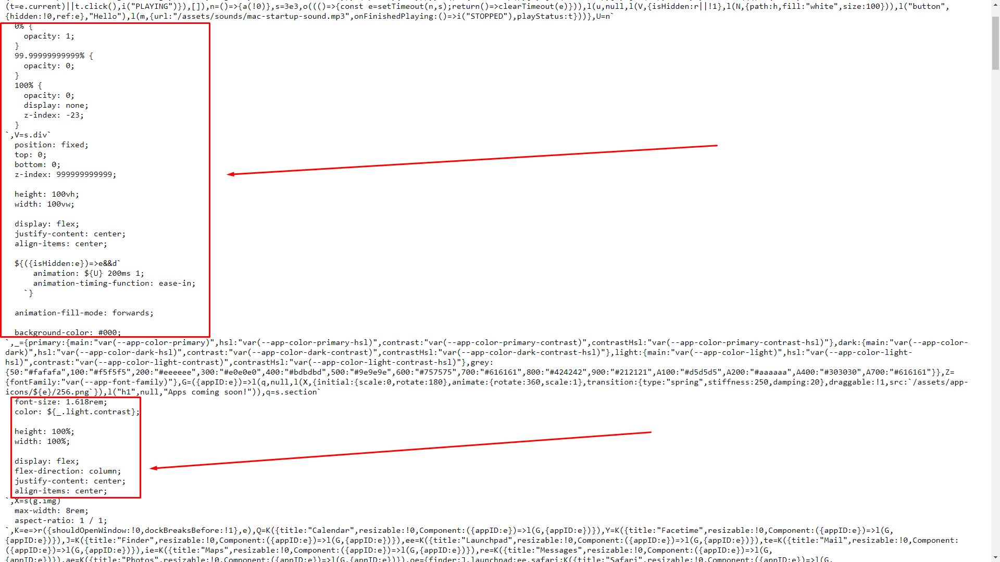
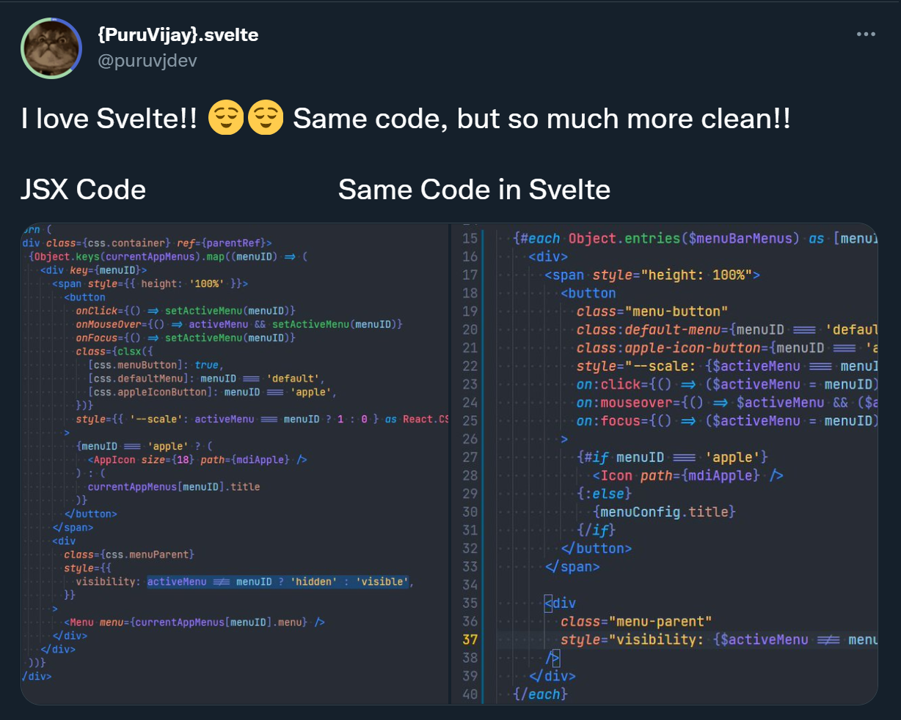
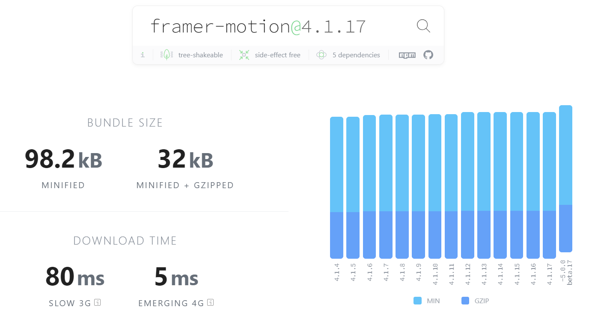

macOS is an amazing operating system. It looks really good, works really fast(Thanks to Apple's hardware), is very consistent, and overall an amazing experience.

Personally, I have never been much infatuated with macOS. But that changed last year, when macOS Big Sur came out with the super sleek and modern design with those beautiful blurs. I instantly fell in love with it 😍. Just look how beautiful it is 😌.

Unfortunately, I couldn't afford to buy the MacBook(You're overpriced, Apple 😑), but I couldn't not want it. I spent weeks just watching review videos and screenshots of it. I am not a designer, but I have a good taste in design, and Big Sur was it! Finally when the craving became too much, I was like, _"Screw it! I'll just make it myself"_


So that's what I did 😁. I recreated the interface of macOS Big Sur for Web. You can see it @ [macos.vercel.app](https://macos.vercel.app).

# Early days (React)!

I began working on this project back in November 2020, with the stack being React with Snowpack as the bundler+dev server, JSS for styling, and restater for state management, and I created just the topbar(without the opening menus), the animated dock, and the background. Nothing much, really. Quite easy to do. You can visit it here [macos-web-mmo5af3r6.vercel.app](https://macos-web-mmo5af3r6.vercel.app/)

If you look closely, the dock animation isn't as smooth as it is in the latest iteration. Not to mention, this very simple app is using loads of dependencies. It loaded <mark>146KB</mark> min+brotli of JS, and 0KB of CSS(It was CSS-in-JS, so no separate CSS file). For reference, the current version in Svelte loads only <mark>28.5KB</mark> of JS, and <mark>3.6KB</mark> of CSS, and it does a **lot** more than the November version.

Here's the `package.json` dependencies of the November version 👇

```json
{
  "@material-ui/core": "^4.11.0",
  "@mdi/js": "^5.8.55",
  "@rooks/use-raf": "^4.0.2",
  "@tippyjs/react": "^4.2.0",
  "date-fns": "^2.16.1",
  "framer-motion": "^2.9.4",
  "react": "^17.0.1",
  "react-dom": "^17.0.1",
  "react-helmet-async": "^1.0.7",
  "restater": "0.0.12",
  "use-sound": "^2.0.1"
}
```

See?! So much stuff for so little!

So this was the state of the app. Then I didn't work on it. I was bored of it. Then I had an accident, broke my spine, was prescribed 3 months bedrest. I was so bored out of my mind, I thought, what the heck, I'll just continue working on it.

So I revived the project, made some heavy changes. Like I threw away `restater` library to use [Jotai](https://github.com/pmndrs/jotai), because it was much more simpler.

Fast forward two months, I made some drastic changes. I replaced Snowpack(Bundler and dev server) with [ViteJS](https://vitejs.dev/). Why? No specific reason, I just felt it was more polished and had some superb features which I could use to make the app smaller in size.

I replaced the existing JSS style with `styled-components`. Not perf related really, just that writing CSS as JS objects wasn't fun.

I also got rid of some dependencies to reduce bundle size.

That brings us to <mark>120KB</mark> min+brotli JS. You can see it for yourself: [macos-web-git-feat-switch-to-vite-puruvj.vercel.app](https://macos-web-git-feat-switch-to-vite-puruvj.vercel.app/)

I was still not satisfied with it. The app felt slow, the dock animation janky, menus wouldn't open up instantly. Not satisfactory!

Then, I did something **very** drastic: I moved the app from **React** to **Preact**.

# The era of Preact

Yepp!! I did that. I'm crazy that way 😏.

Anyways, moving React to Preact was a very smooth experience. I just had to install the official `@preactjs/preset-vite` Vite plugin by Preact team, and it took care of aliasing `react` in `import React from 'react'` to `preact/compat` and everything. It was very seamless. It just worked. Huge kudos to the Preact team!!

And that, my friend, made all the difference in the world.

The site got fast. Animations lost their jank. Menus opened instantly. **Everything just worked!**.

Best part: Bundle size went down by a **lottt!!**. React + React DOM is 42KB. Preact Core + Compat is just 4KB, max!

You can check it out here yourself [macos-web-git-feat-move-to-preact-puruvj.vercel.app](https://macos-web-git-feat-move-to-preact-puruvj.vercel.app/).

> You will find the bundle size is not drastically less here compared to the previous React iteration. That's because I added some dependencies in the period before transitioning.

This was great, but there was one problem: Too many dependencies.

Here's the `package.json` `dependencies` field 👇

```json
{
  "@mdi/js": "^5.9.55",
  "@rooks/use-raf": "^4.9.2",
  "@tippyjs/react": "^4.2.3",
  "color2k": "^1.2.4",
  "date-fns": "^2.18.0",
  "framer-motion": "^3.10.0",
  "idb-keyval": "^5.0.4",
  "immer": "^8.0.1",
  "jotai": "^0.15.0",
  "preact": "^10.5.12",
  "prop-types": "^15.7.2",
  "react-helmet-async": "^1.0.9",
  "react-is": "^17.0.1",
  "react-lazily": "^0.9.0",
  "react-rnd": "^10.2.4",
  "react-slider": "^1.1.4",
  "react-sound": "^1.2.0",
  "styled-components": "^5.2.1",
  "styled-reset": "^4.3.4",
  "throttle-debounce": "^3.0.1",
  "tippy.js": "^6.3.1",
  "use-interval": "^1.3.0"
}
```

This is a lot of dependencies at this point. Doesn't look good, does it? 🤐

# Goodbye styled-components 🏳️

So in my quest to make the app smaller and faster, I found `styled-components` to be one of the roadblocks.

What was the issue with it? Well, first thing, CSS-in-JS is always less performant than just raw CSS(Well written CSS. Bad, duplicated styled don't count 😼). 2nd, `styled-components` added 12KB bundle size to the app.

And the most important one: The output CSS wouldn't minify.

Generally, when you are writing in `.css` or `.scss` files, your CSS is minified completely, that is all spaces and line breaks are removed, making it smaller to send over the wire.

But with styled-components, because I'm writing the CSS inside JavaScript strings, the CSS tooling can't minify it by default, so that CSS remains unminified.



See? All the code is here as it is.

And I couldn't use the <mark>babel-plugin-styled-components</mark>, as it wouldn't work with Vite, for some reason. And leaving Vite wasn't an option.

So it was then that I decided to move to the basics, **CSS Modules** (SCSS Modules, to be exact 😉)

So I did that. Took a lot of effort, but the final result was worth it. It took the JS size from around 110KB to <mark>85KB</mark>, and the CSS was <mark>3.3KB</mark>. This was a huge amount of reduction, and made the app feel really fast. The load of supplying CSS was removed from the JS, and that alone made a lot of difference.

Here's an in-detail write-up of moving to CSS Modules: [Why I moved from Styled Components to (S)CSS modules](https://www.puruvj.dev/blog/move-to-css-modules-from-styled-components)

And, because this process required me to touch the whole project at once, I got the chance to revisit some not-so-good code and improve it, resulting in me getting rid of a lot of dependencies. This is the package.json's `dependencies` field after this change 👇

```json
{
  "@mdi/js": "^5.9.55",
  "@reach/slider": "^0.14.0",
  "@rooks/use-raf": "^4.10.0",
  "@tippyjs/react": "^4.2.5",
  "clsx": "^1.1.1",
  "date-fns": "^2.19.0",
  "framer-motion": "^4.0.3",
  "idb-keyval": "^5.0.4",
  "immer": "^9.0.1",
  "jotai": "^0.16.0",
  "preact": "^10.5.13",
  "react-rnd": "^10.2.4",
  "tippy.js": "^6.3.1",
  "use-interval": "^1.3.0"
}
```

That's a lot of reduction compared to the previous iteration.

So all this brings us to the final situation of macOS: Built in preact, styled with CSS Modules, only 85KB loaded at first, and pretty smooth usage.

But me being me, I strived to make it even better. Because there wasn't much scope for radical techniques, I resorted to the ultimate technique: Code Splitting

# Go Code splitting!

Implementing Code splitting was very easy. The components that aren't needed on the first load, I split them away into their own separate chunks.

One component where I do code splitting was the `AppNexus.tsx`. This is basically a gateway to render the right app component when you open any app. This is as easy as 👇

```tsx
import { AppID } from '__/stores/apps.store';
import { lazy } from 'react';

type AppNexusProps = {
  appID: AppID;
  isBeingDragged: boolean;
};

const Calculator = lazy(() => import('./Calculator/Calculator'));
const VSCode = lazy(() => import('./VSCode/VSCode'));
const Calendar = lazy(() => import('./Calendar/Calendar'));

const PlaceholderApp = lazy(() => import('./Placeholder/Placeholder'));

export const AppNexus = ({ appID, isBeingDragged }: AppNexusProps) => {
  if (appID === 'calculator') return <Calculator />;
  if (appID === 'vscode') return <VSCode isBeingDragged={isBeingDragged} />;
  if (appID === 'calendar') return <Calendar />;

  return <PlaceholderApp appID={appID} />;
};
```

See?? Super easy to do!!

This brought the initial bundle size down to just <mark>62KB</mark> min+brotli with 3.9KB of CSS. 23KB smaller
by just dynamically importing stuff 🤯🤯

And this is when I took a break from this project(again!)...

Until 12th August, 2021, when I was so bored I decided to just rebuild the whole thing again in Svelte. So that's what I did.

# Svelte: The golden age

I began migrating on morning of 12th August, kept at it whole day, and got the Dock, the menubar, and the action center working, as it was a matter of copy pasting only.

As for the dock animation, I had [already done an article about it](https://puruvj.dev/blog/macos-dock-animation-svelte), so all I had to do was just copy paste stuff.

I continued on 13th too, working whole day, implementing the different apps. Finally completed by the end of the day.

## Results

Unsurprisingly, the bundle size went down and runtime performance went up. If you have been following Web Dev news on Twitter and Reddit, you probably saw this coming from a mile away.

But the extent of these improvements was **very** surprising. I'll just let the cat out of the bag: Initial bundle size went down to <mark>28.5KB</mark> of JS, min+brotli🤯🤯🤯🤯🤯. That's less than half of what it was before.

And runtime performance went up by a lot. With the previous version, the dock animation could get janky when my computer was overloaded. Not by a lot, but it was visible. After I moved to Svelte, even that much jank was gone. **Fully gone!**

And here's the takeaways from this process 👇

## Svelte Code is much simpler

This comes as no surprise, Svelte code is much shorter, more readable than JSX.

I tweeted a little part of it 👇



> [Source](https://twitter.com/puruvjdev/status/1425866919853260800)

Every single component in the new Svelte Codebase is around 20-30% smaller. The number of files is literally **half** as before, cuz I don't need to separate `.scss` files anymore. Styles exists in the one `.svelte` file only.

And some components that are now longer than before, they are longer cuz I got rid of some abstracted small components entirely, which I had refactored away earlier. Because Svelte is so simple in terms of readability, I could just inline these components and the code still looked very clean. 💯 points for Svelte!!

## Svelte Motion = 🔥

macOS is an Operating system, and no OS is complete without animations. This is where Svelte's built in Motion stores and transitions come in.

Svelte's Motion stores are extremely lightweight, and extremely powerful. They power the dock animation when you hover over it, and using them is extremely easy.

Previously I was using Framer Motion. Framer Motion is a great library and my go-to thing for animations in P/React. But there's just one little issue with it: It's not exactly small 🥲

This is the bundlephobia size of `framer-motion`



This isn't very big, but this ain't small either. 32KB Gzip is a lot 🤐

Framer Motion's size is indicative of its capabilities. Framer Motion can do a **lot**. Really, it can do anything animation related under the sun.

But ofc, there's no such thing as a good tool and a bad tool. There's only the **right tool for the JOB**, and Framer Motion was overqualified for my use case.

But Svelte fit right in. It had exactly what I needed(Except for one small piece, which I got from `popmotion`. Jut 3Kb big 😌), and most importantly, it allowed me to programmatically handle it, which is easier than going the declarative route.

Here's a little example. Go to [macos.vercel.app](https://macos.vercel.app), click on any icon on the dock. It jumps up an down once.

Animating that with Framer Motion looked somewhat like this 👇

```js
const [animateObj, setAnimateObj] = useState({ translateY: ['0%', '0%', '0%'] });

<motion.span
  onTap={() => setAnimateObj({ translateY: ['0%', '-39.2%', '0%'] })}
  initial={false}
  animate={animateObj}
  transition={{ type: 'spring', duration: 0.7 }}
  transformTemplate={({ translateY }) => `translateY(${translateY})`}
>
  {/* Markup */}
</motion.span>;
```

This is pretty simple, but there are a few issues with it: Have to tell it to not run in the beginning, how to translate it. All these can be condensed into 1 big issue: It's declarative.

I'm a JS guy first. Declarative programming doesn't come naturally to me. I see the world as cause and effect. You click, something happens.

Doing the same thing in Svelte was much more easier and programmatic 👇

```html
<script>
  // Spring animation for the click animation
  const appOpenIconBounceTransform = tweened(0, {
    duration: 400,
    easing: sineInOut,
  });

  async function openApp(e: MouseEvent) {
    /* State related stuff */

    // Animate the icon
    await appOpenIconBounceTransform.set(-39.2);

    // Now animate it back to its place
    appOpenIconBounceTransform.set(0);
  }
</script>

<span style="transform: translate3d(0, {$appOpenIconBounceTransform}%, 0)">
  <!-- Stuff -->
</span>
```

It's very clean and simple now. Plus it's not declarative anymore. I **tell** the program **explicitly** when to go up, and when to come back down. The program literally reads like this: `Go up -39.2%, and when you're done with that, go down to base position`. As simple as that ¯\\\_(ツ)\_/¯

## Those transitions 😍
