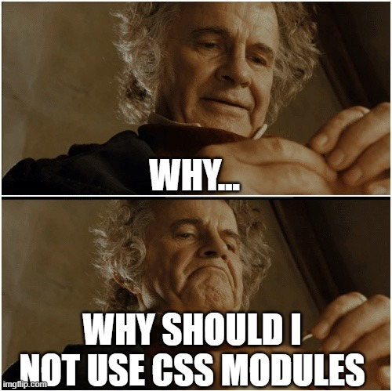
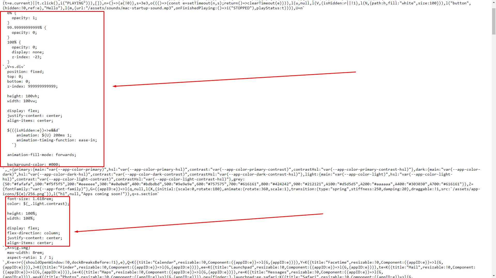
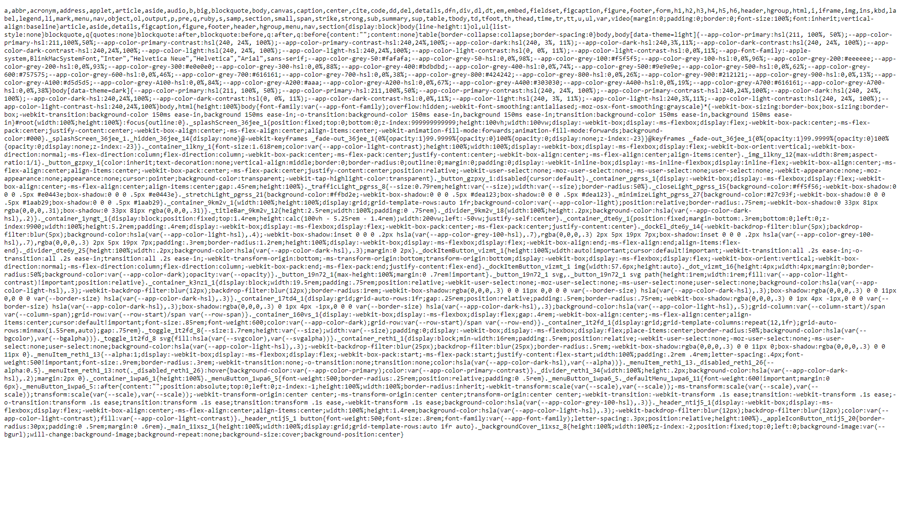
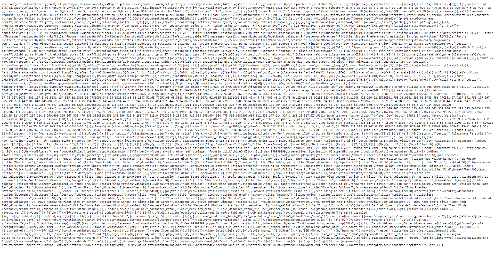

> Artwork by [Lucas Benjamin](https://unsplash.com/photos/wQLAGv4_OYs)

This blog post will be about my reasons to move from Styled Components to SCSS Modules. Its gonna be a raw and non-technical one (i.e., you probably won't learn anything new from it).

# What is styled-components?

Styled Components is a radical, new way of writing CSS for your React components. You can simply create components out of your styles

```tsx
export const Main = () => {
  return <HelloWorld>Hello World</HelloWorld>;
};

const HelloWorld = styled.h1`
  font-weight: 700;
  line-height: 1.618;
`;
```

This is a very, very convenient way of writing CSS. All your CSS lives in the same file as your main logic. It's ultimate [Colocation](https://kentcdodds.com/blog/colocation/). Plus if you're a freak about small components, this really enforces you to write small components, cuz the components grow large very quickly thanks to all 3 techs in a single file: HTML + CSS + TS(Yes, I'm one of those people who breath TypeScript 😋). So you kinda feel obligated to break your components into smaller pieces, which is ultimately good. Modularity is paramount.


Its just like Svelte and Vue's SFCs. They figured it out correctly, while this makes me mad about React.

Anyways, rant aside, this way of writing styles is really good, I can't insist enough. Need dynamic prop based styles? No worries, just pass props over to your styled component, and use it in there

```tsx
export const Main = () => {
  return <HelloWorld weight={600}>Hello World</HelloWorld>;
};

const HelloWorld = styled.h1<{ weight: number }>`
  font-weight: ${({ weight }) => weight};
  line-height: 1.618;
`;
```

> Pardon the TypeScript code if you're not familiar with it or hate it. It can't be helped. Its part of my very being now 😇.

And yes, it automatically does the scoping and vendor prefixing. vendor prefixing is runtime generated, that is it determines if the browser needs vendor prefixes, then it will churn out styles with vendor prefixes. Its like a sweet runtime PostCSS and Autoprefixer running in the browser.

It makes stuff very very easy. But this is where it starts to go wrong if you don't fully understand how React and its rendering processes work.


# What are CSS Modules?

CSS Modules are a slightly-less radical way of writing CSS. Its basically separate CSS files, but only modular. Syntax remains the same mostly, but it's scoped to the components where it is used (By mangling class names). The general pattern of these is this:

```txt
|-HelloWorld
  |-HelloWorld.tsx
  |-HelloWorld.module.css
```

> Notice I use `.css` at the end. It could be `.scss` or `.less` or `.styl` too, you name it. I personally use SCSS modules.

Notice that our CSS Module has in the name itself that its a module, `*.module.*`. Its a <mark>Convention over Configuration</mark> approach, very prevalent in futuristic bundlers like [ESBuild](https://esbuild.github.io/), [Vite](https://vitejs.dev/), [Snowpack](https://www.snowpack.dev/), etc.

And to use them, you import the css file in JS, and refer to it like this.

```tsx
import css from './HelloWorld.module.css';

export const Main = () => {
  return <h1 className={css.helloWorld}>Hello World</h1>;
};
```

Meanwhile our CSS file:

```css
/* HelloWorld.module.css */

.helloWorld {
  font-weight: 700;
  line-height: 1.618;
}
```

The generated CSS is something like this:

```css
/* HelloWorld.module.css */

.__B56BLAH_helloWorld_4269BRUHBRUH {
  font-weight: 700;
  line-height: 1.618;
}
```

The className is mangled, and the value is substituted in place of `css.helloWorld` in our component.

> Alright I took some artistic liberty and added some weird Elon Musk-y stuff there. The actual mangled output would be much smaller and sane 😁.

CSS modules are very handy for this. Plus you can add tooling like `autoprefixer` to add vendor prefixes, compile stuff back to old CSS for browser compatibility.

# The app in question

Now the intro is over, let's look at the app which I moved from Styled components to CSS modules. Let me introduce you to my baby, [macos.now.sh](https://macos.now.sh), a macOS Big Sur clone written In Preact, TypeScript and uses Vite as the bundler. Check it out, I think you'll like it (Tip: Just hover over the app dock at the bottom).

Anyways, this whole app was written in Styled Components, until I threw it out of the 30+ components in favour of CSS Modules.

# Why? 🧐

The simple answer 👇



Just kidding 😅. Here's a full technical explantion 👇

## CSS not minified

Take a look at this image 👇



This the main production bundle of the app. As you can see, it's minified in some place, and not, in other places. You can see the unminified part is the `CSS` part. These are the styles I wrote as template literals(Or string literals, I mix both up 😅). As these aren't CSS to bundler's internal CSS minifier, it stays as it is, which is kinda bummer. I am a die-hard performance freak, and the 1st rule of performance on Web: Bundle and minify your resources. Make them as small as possible, then make them even smaller ¯\\\_(ツ)\_/¯.

Seriously, you can check this file out right here: [https://macos-web-fwyxhwxry-puruvj.vercel.app/assets/index.da0c587c.js](https://macos-web-fwyxhwxry-puruvj.vercel.app/assets/index.da0c587c.js)

### Why not use the babel plugin? 🤨

If you don't know, Styled Components has a Babel plugin for this purpose exactly, minifying the CSS inside the template literals, and its pretty decent.

But it wasn't working for me.

No literally, it wasn't **working** for me, as in I set up the babel plugin and did the correct config, installed the plugin, but no it wasn't working. Something was going wrong with Vite's plugin running. The plugin was working, as build times had increased a lot from before, but the output was still not minified. The same plugin worked perfectly in a `create-react-app` reproduction I created to check this.

But anyways, even if this problem was solved, there's a bigger Elephant in the room

## CSS injected by JS

All of this CSS still lives in the JavaScript, and is only applied when JS is evaluated by the browser, and I'm pretty sure you know of this, <mark>JavaScript is HEAVY!!!</mark>. It takes quite some CPU power to parse it, and it's heavy on main thread. Our HTML being rendered by JS itself is pushing the limit, but rendering CSS using JS too? That's way too much load on the browser.

Browsers have become amazingly efficient at parsing JS as well as rendering HTML and CSS, all in parallel. But JavaScript doing all the work, well, browsers still aren't that efficient at it(For good reason).

If you want ultimate performance, CSS in separate files or inlined in style tag is the way too go. It doesn't get better than that.

## Performance had become important

When I started this project almost 6 months ago (November 2020), I made myself a little deal: Do not stress about the performance. Off course, at that time, Performance meant just lower bundle sizes, not runtime performance, cuz I really had never run into any runtime perf issues before. But this project is different in the sense that there's a lot going on. There are loads of `requestAnimationFrame`s, tons of component, lot of global state, and what not going on. And all of it is on the screen at once. You can't really lazy load much stuff, cuz almost everything is eagerly loaded.

All of it was weighing down the runtime perf of the app. The dock animation was janky, the menus took a while to open up, theme switching was also noticeably janky. So I had to finally consider the runtime performance. And the most obvious choice was to start throwing out fancy stuff and move back to basics again.

# Did it work?

Absolutely!! The performance increased like crazy. Both runtime as well as bundle size.

This is the compressed CSS file output. Its run through Autoprefixer for vendor styles, and Vite automatically puts it into a single CSS file, super compressed. Take a look yourself 👇



And here's the `index.js` 👇



Completely minified, JS lives in js files, CSS lives in its own file, and its all processed parallelly by the browser, styles aren't generated for every prop change like in styled components. Only the classes are applied, and the styles for that are already present in the CSS file. Just like the old times, simply and fast.


## Reduced Bundle Size

This total maneuver took away 60KB from my bundles, which is just huge. I removed `styled-components`, `react-is`(Styled components require it for some reason), `styled-reset` and `color2k`(For color manipulation).

If you have been coding for some time, you'll know how incredibly satisfying deleting old stuff is. 😌

# What did it cost?


Yup. I lost something: A great API design.

Writing styles in Styled Components is a pleasure. The API design is amazing, and I prefer it over CSS modules in terms of writing the code.

If you aren't using a style, means you aren't using a component, so the component will be called out by VSCode as not being used, so you can easily remove it. No more dead styles!!

Plus, compare the component below in Styled Components:

```tsx
interface ActionCenterSurfaceProps {
  grid: [[number, number], [number, number]];
  children: ComponentChildren;
}

export const ActionCenterSurface = ({ grid, children }: ActionCenterSurfaceProps) => {
  const [[columnStart, columnSpan], [rowStart, rowSpan]] = grid;
  const [theme] = useTheme();

  return (
    <Container
      columnSpan={columnSpan}
      columnStart={columnStart}
      rowSpan={rowSpan}
      rowStart={rowStart}
      theme={theme}
    >
      {children}
    </Container>
  );
};

type ContainerProps = {
  columnStart: number;
  columnSpan: number;

  rowStart: number;
  rowSpan: number;

  theme: TTheme;
};

const Container = styled.section<ContainerProps>`
  display: grid;
  grid-auto-rows: 1fr;
  gap: 0.25rem;

  position: relative;

  padding: 0.5rem;

  border-radius: 0.75rem;

  background-color: hsla(${theme.colors.light.hsl}, 0.5);

  ${({ columnStart, columnSpan, rowSpan, rowStart, theme: localTheme }) => css`
    grid-column: ${columnStart} / span ${columnSpan};
    grid-row: ${rowStart} / span ${rowSpan};

    box-shadow: hsla(0, 0%, 0%, 0.3) 0px 1px 4px -1px, 0 0 0 ${localTheme === 'dark' ? 0.4 : 0}px hsla(
          ${theme.colors.dark.hsl},
          0.3
        );
  `};
`;
```

This is one of my components in Styled Components before. As you can see, it accepts values that are numbers. If there were booleans, it would've been easy to make a class and apply the styles then. But here, the value can be anything.

And now look at the new CSS Module version:

Component:

```tsx
interface ActionCenterSurfaceProps {
  grid: [[columnStart: number, columnSpan: number], [rowStart: number, rowSpan: number]];
  children: ComponentChildren;
}

export const ActionCenterSurface = ({ grid, children }: ActionCenterSurfaceProps) => {
  const [[columnStart, columnSpan], [rowStart, rowSpan]] = grid;
  const [theme] = useTheme();

  return (
    <section
      className={css.container}
      style={
        {
          '--column-start': columnStart,
          '--column-span': columnSpan,
          '--row-start': rowStart,
          '--row-span': rowSpan,

          '--border-size': `${theme === 'dark' ? 0.4 : 0}px`,
        } as React.CSSProperties
      }
    >
      {children}
    </section>
  );
};
```

And the CSS for this component:

```scss
.container {
  display: grid;
  grid-auto-rows: 1fr;
  gap: 0.25rem;

  position: relative;

  padding: 0.5rem;

  border-radius: 0.75rem;
  box-shadow: hsla(0, 0%, 0%, 0.3) 0px 1px 4px -1px, 0 0 0 var(--border-size) hsla(
        var(--app-color-dark-hsl),
        0.3
      );

  background-color: hsla(var(--app-color-light-hsl), 0.5);

  grid-column: var(--column-start) / span var(--column-span);
  grid-row: var(--row-start) / span var(--row-span);
}
```

As you can see, the prop values are passed to the CSS using CSS variables. This method is good too, but the Styled Components method is cleaner in my opinion.

In future, I might try out libraries like [Linaria](https://linaria.dev/) which, during coding have the exact same API as `styled-components`, but the runtime is completely removed on build and the CSS is extracted into separate CSS files, which is super DOPE!!! 🤓

Alright, that's it for today.

Signing off!! 👋
