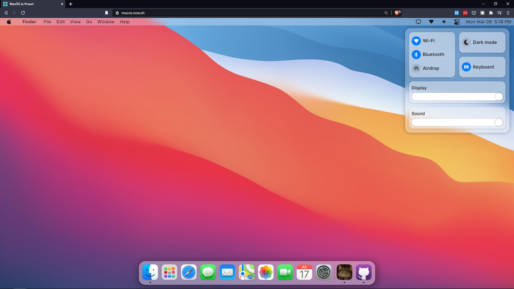

Heya you awesome dev!!Glad to see ya here 🙂. This post is just a recount of my experience when I moved a medium size React app(30+ components) to use Preact, in just <mark>10 minutes</mark>.

## Is it true?

In case you are wondering if my claim of moving an app this big from one framework to other in just 10 minutes is true or just some clickbaity hoax, I assure you it isn't true. It didn't take 10 minutes for this.

It took somewhere around <mark>8-9</mark> 😅😁

Yup. It took **less than 10 minutes** to move it. I put 10 minutes in the title b'coz humans love multiples of 10 a lot 😉

# What is this app?

Alright, so the app in question is a fun side project I'm working on, [macOS Web](https://macos.now.sh), which is basically a MacOS Big Sur clone for Web(Don't tell Apple 🤫). As you can see in the screenshot below, it looks like MacOS Big Sur, just running in the browser.



I started making it in <mark>React</mark> and <mark>Snowpack</mark> (Think of it as Webpack that does everything you want it do, without telling it anything) boilerplate, then around 2 weeks back, I moved it from <mark>Snowpack</mark> to <mark>Vite</mark> (Similar to Snowpack, just more refined and with more features.), and got some really cool features out of it.

Then just a few days ago, I tried an experiment to move it to Preact. I treat this project as a playground of sorts and am constantly stirring things up in it. I just made a new branch, and started fooling around. And surprisingly, this whole moving took less than 10 minutes.

# Process

Here's a brief breakdown of the whole process.

## Installing right dependencies

This is parts of my `package.json` file before the transfer:

```json
{
  "dependencies": {
    "react": "^17.0.0",
    "react-dom": "^17.0.0"
  },
  "devDependencies": {
    "@types/react": "^17.0.0",
    "@types/react-dom": "^17.0.0",
    "@vitejs/plugin-react-refresh": "^1.3.1",
    "vite": "^2.0.5"
  }
}
```

As you can see, we have `react` and `react-dom` as dependencies, their respective TypeScript Typings as `devDependencies`, along with `vite` itself, and lastly the special package `@vitejs/plugin-react-refresh`. This last package is responsible for the <mark>Hot Module Reload</mark> magic of Vite with React.

> Note: The package.json above contains only the relevant code for this article. There are over 20 dependencies in the actual project.

So how do we move to Preact then? The answer lies in looking at the <mark>preact-ts</mark>(Preact starter with TypeScript) starter template of vite, and the only content here was 👇

```json
{
  "dependencies": {
    "preact": "^10.5.9"
  },
  "devDependencies": {
    "@prefresh/vite": "^2.0.0",
    "vite": "^2.0.5"
  }
}
```

Whoa!! That was drastic!! Notice that there's no `preact-dom` here, as `preact` has all the DOM stuff built in. Plus we have a different package <mark>@prefresh/vite</mark>. This I gathered was the HMR module for Preact with Vite.

So all I did was delete the `react` related packages, and installed these 2 packages(`preact` and `@prefresh/vite`).

> Why no `@types/preact`?
>
> Well, We needed `@types/react` because React doesn't ship its own Typings, which can make DX feel like shooting in the dark, so the community has kindly provided types themselves for it. \
> But preact is a different story. It ships its own TypeScript typings, so we don't need any extra packages. It's just awesome that way 😍.

## Modifying vite.config.ts

The `vite.config.ts` with React 👇

```ts
import { defineConfig } from 'vite';
import reactRefresh from '@vitejs/plugin-react-refresh';

// https://vitejs.dev/config/
export default defineConfig({
  plugins: [reactRefresh()],
  esbuild: {
    jsxInject: `import React from 'react'`,
  },
});
```

And the new config is:

```ts
import { defineConfig } from 'vite';
import prefresh from '@prefresh/vite';

// https://vitejs.dev/config/
export default defineConfig({
  esbuild: {
    jsxFactory: 'h',
    jsxFragment: 'Fragment',
    jsxInject: `import { h, Fragment } from 'preact'`,
  },
  plugins: [prefresh()],
  alias: {
    react: 'preact/compat',
  },
});
```

1. Notice the `esbuild` property. Vite is built on top this super fast ES module bundler `esbuild`, here we are passing some options to it. `jsxFactory` and `jsxFragment` are exactly what they look like. The `jsxInject` here is a very ✨magical✨ property, that automatically puts the statement passed to it in every single file, so it saves you the trouble of importing `h` from preact in every single file, or `React` for a `react` app. And during the production build, vite strips out unnecessary imports, so files not needing preact will end up with no preact at all. So no harm is done ultimately.

2. In the `plugins` property, I have replaced `reactRefresh` with `prefresh`, and now our app supports HMR for preact.

3. Lastly, `alias` is the most, **MOST** important property here. In this project, I'm using 15+ packages that import directly from `React`, and moving to preact would have broken them completely. So the alias property accepts a key value pair. In this case, I'm pointing `react` to `preact/compat`, which is `preact`'s compatibility layer to work with existing react apps.

## Fix tsconfig.json

We are using TypeScript with React, and we have to tell it that the JSX factory and fragments are now different, so let's do that small change.

```json
{
  ...
  "jsx": "preserve",
  "jsxFactory": "h",
  "jsxFragmentFactory": "Fragment"
  ...
}
```

## Modify index.tsx

The entrypoint of our app is the `index.tsx` app, which would need some modification to work with preact. Luckily the changes needed are **tiny**.

The code before 👇

```tsx
import ReactDOM from 'react-dom';
import { Desktop } from './views/desktop/Desktop';

ReactDOM.render(<Desktop />, document.getElementById('root'));
```

Here we are doing a `ReactDOM.render`. But preact itself has a `render` method. SO let's swap it out with.

```tsx
import { render } from 'preact';
import { Desktop } from './views/desktop/Desktop';

render(<Desktop />, document.getElementById('root'));
```

And BAM!! That's it. Only these 4 files needed to be changed. And this is how it all happened in less than 10 minutes.

# Results

Let's talk business. What benefits did I get out of this weird, eccentric wish to move a whole codebase from one framework to another?

## No need to change imports

There are over 30+ files that import something from `react`. And even now, they're importing from `react`. Only difference is that its actually `preact/compat` underneath. I didn't have to go and change every single import.


## Reduced bundle size

`react` alone isn't everything. It needs to be paired up with `react-dom`, to actually render stuff on web. Both of these combined weigh <mark>129KB</mark> minified, and <mark>42.4KB</mark> min+gzip. That's not much really, but I'm a bundle size freak. I want as less size as possible.

Moving to preact did that for me. `preact` is just <mark>4KB</mark> min+gzip. 90% smaller!🤯🤯. Quite miraculous, right?

## Runtime performance

Oh boy, this one is very very interesting.

You see, first I heard of preact was 3 years ago. I found out this 3KB alternative to React, and I quite liked the concept. I also read in some article that its runtime performance was much better. I didn't care at the time, because really, browsers are amazingly fast, and runtime perf didn't matter to me much. So I never cared about it.

But in macOS Web, I realized I desperately needed better runtime performance because of some very janky animations in it. The whole app was very laggy. This was one of the motivations of switching to preact.

So when I was done moving the app, and fired up the dev server, my jaw dropped to the floor.


All the jank was gone!! Literally **GONE**. Just vanished in thin air. When I hovered over the dock, perfectly smooth. When I open menus, perfectly smooth. When I switched between light and dark themes, perfectly smooth.

You can try it out yourself. (Better you view them on desktop)

React version 👉 [macos-web-fyri0fstj-puruvj.vercel.app](https://macos-web-fyri0fstj-puruvj.vercel.app/) \
Preact version 👉 [macos.now.sh](https://macos.now.sh)

See for yourself which is smoother.

# Unsung hero

Until now I've been singing about Preact, but the true hero of the story is <mark>Vite</mark>. Look back into the section where I'm installing the dependencies. There's only 1 needed devDependency needed there, `vite`. `vite` does everything for you under the hood. It transpiles typescript without any unneeded packages, it transforms JSX into JS readable format, it minifies the crap out of the bundles, it supports all kind of pre-processors, and it does all that without you telling it to do that.

If I had initialized this app with `create-react-app`, which is kind of the standard, this migration wouldn't have been possible, as it would take a lot of time and lots of banging your head against the wall.


But with vite, it was easy as `npm install preact` and changing `index.tsx` to use `preact` instead of `react`.

Vite is very amazing, and very versatile. I'm very much in love with it and have no intention of moving away from it anytime soon.

And if you're skeptical about it, Vite is created by the creator of VueJS, [Evan You](https://twitter.com/youyuxi). And its not just for Vue, it's very much framework agnostic. You can use it with any framework(React, Preact, Vue, lit-element, and more. Heck even the next version of svelte is going to be based on Vite itself).

So I really invite you to check Vite out sometime. It's like a breath of fresh air. [Vite Homepage](https://vitejs.dev/)

I hope you got something good out of this article 😉.

Signing off!
