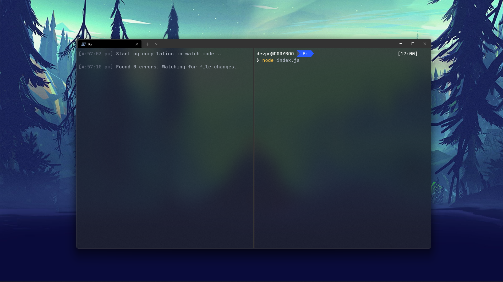

Have you worked with NodeJS in past? Have you tried to add TypeScript to the project, and realized how bad the Developer Experience suddenly becomes?

Sure, you have the great DX that **writing TypeScript code** provides, but get lost into the rabbit hole, that is to make sure the various build tools you pull in play nicely with each other & provide the correct output you want.

If it's a web based project, you don't need to worry at all. [Create React App](https://reactjs.org/docs/create-a-new-react-app.html), [Vite](https://vitejs.dev/), [Snowpack](https://www.snowpack.dev/) and many such build-and-server tools have got your back and work seamlessly.

But for browser, it isn't as big of an issue adding all these tools, because

- They provide **marvelous** Developer Experience, from setup to starting server to building the final app
- It's expected on the web. You always need to have a web server running in the background, so integrating some extra build tools in the same process doesn't really hurt.

But for NodeJS, it's a whole **new** story. Writing code for NodeJS at its very base is just writing a JS file, and executing it via `node index.js`. That's how it's been since the beginning.

So, to visualize this whole pain, let's introduce a character to the story: **Maahi**. Maahi is a frontend web developer, and now she's trying to get into writing NodeJS code. She thinks: **Easy peasy, it's just JavaScript, how different it can be!**. And that is true, after 2 weeks of reading article after article, she cracks NodeJS development enough to be able to write full fledges programs in it.

But after just 2 weeks, she's already heartsick for her most favorite part of programming: **TypeScript**. She had been very disciplined and focused, and focused only on raw NodeJS-edition of JavaScript.

So she searches on Google "TypeScript with NodeJS". She looks, and finds this out 👇

```bash
tsc
node index.js
```

> Let's just skip over the whole crazy getting-tsconfig-right song and dance, that's out of scope of this article. Let's just assume the entrypoint files are specified, and outputted as one single `index.js` file

So now she can just write TypeScript and it will just work!!! All she needs to do is `tsc && node index.js` everytime she wants to run the script, and bam!! It just works!! There's a sparkle in her eyes, writing her favorite language!! She just can't get enough of this awesomeness 😌.

But the sparkle is gone very soon. Why? Cuz this `tsc && node index.js` command is slow. Excruciatingly slow!!! She enters this command everytime, and then has to wait for seconds, literally, to have the code run. Soon she is just irritated at the speed.

She thinks, "It wasn't so irritating doing web dev with local server and all."

Her conscience replies back, "Off course dummy, the setup there is superb, and very smart, the moment you change your code, it recompiles everything! It's a watcher!!!"

Her eyes flew open!!! How did she not think of putting a code watcher here.

She scrambles for her keyboard, types "TypeScript watch code" in the search box, and instantly find a super simple flag: `--watch`.



She is instantly delighted!! She opens up split terminals, and type `tsc -- watch` in one, and `node index.js` in other terminal whenever she wishes to run the code. She doesn't have to wait for it to compile anymore, as it's compiling in real time in background. It feels as if she's writing TypeScript, and it is running almost natively!! She's really happy with it

## A week passes by...

A week has passed by. She's pretty happy with her setup. Just start the `tsc --watch` command, open another terminal and execute node there. Life's good.

Then one day, she comes in to work, starts writing the code and running `node index.js` as usual. She notices it isn't working. Whatever code she wrote, it doesn't seem to be working. She puts `console.log` every ten lines, every file, every conditional and keeps checking. She's on the verge of pulling her hair out, but then she opens the generated `index.js` to inspect what is happening. There, she finds, all the code she wrote today isn't even there. None of the logic, no `console.log`s she added.

The revelation hits her hard, and she reciprocates the favor by hitting her head repeatedly.

She realized she hadn't started the `tsc --watch` command today. So technically, her code wasn't compiled to the output, the output folder still had code from previous day.

The sweet spot she had been with this approach is now fading away. After that debacle, she doesn't like this approach anymore. She admits it's a human mistake, anyone can do it, but she still seethes inside. The way this whole **running-the-program-in-command-line** works, makes starting a watcher feel unnatural.

She's even considering dropping TypeScript now. Which alone is quite tragic. Even if uses the [JSDoc sugar to get TypeScript like features working in JavaScript](https://www.puruvj.dev/blog/get-to-know-typescript--using-typescript-without-typescript), it still isn't as good a an experience as writing TypeScript directly is.

So she's just browsing twitter, reading web development news. She suddenly comes across this new tool called [esno](https://github.com/antfu/esno). She opened it up, saw the docs, and her eyes flew wide open!!


