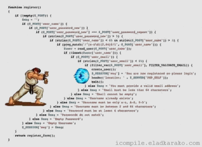

These is gonna be a meme-tastic blog post. Strap yourself in.

So, I guess you read the [super]clickbaity title, and couldn't resist it, huh? Well, no worries, I **promise** you 😁 this is gonna be good.

# History lesson 😴

NodeJS initially shipped with callbacks for its amazing asynchronous model which made it an overnight star in the first place. And callbacks were cool. You could read a huge file, and write the code in such a way to simply wait for the response to come out. This applied to database reads, XHR calls(ajax). This model was groundbreaking when it came out.

Callbacks follow this pattern 👇

```js
callback(param1, param2, param3, (error, data)) {
  // Do something
}
```

Note, there can be any number of parameters before the actual callback as the last parameter, and the callback doesn't have to have only `data` either, it can be any number of parameters, or not have any, other than the `error`.

But there's a funny thing that happens when you dive super deep into something. **YoU fInD oUt ItS fLaWs.** 👇

```js
fs.readdir(source, function (err, files) {
  if (err) {
    console.log('Error finding files: ' + err);
  } else {
    files.forEach(function (filename, fileIndex) {
      console.log(filename);
      gm(source + filename).size(function (err, values) {
        if (err) {
          console.log('Error identifying file size: ' + err);
        } else {
          console.log(filename + ' : ' + values);
          aspect = values.width / values.height;
          widths.forEach(
            function (width, widthIndex) {
              height = Math.round(width / aspect);
              console.log('resizing ' + filename + 'to ' + height + 'x' + height);
              this.resize(width, height).write(dest + 'w' + width + '_' + filename, function (err) {
                if (err) console.log('Error writing file: ' + err);
              });
            }.bind(this)
          );
        }
      });
    });
  }
});
```

Oh boy, my eyes bleed 🙈

I guess this twitter meme was on point 👇



# Enter promises

Promises radicalized the whole scene. They made our code even cleaner. They follow a much simpler structure. No need for all that indentation inside indentation inside indentation. Max to max 1 level of indentation is needed

```js
const finalData = fetch('https://api.example/com')
  .then((req) => req.json())
  .then((data) => cleanUpData(data))
  .then((data) => doEpicShit(data));
```

Using the `.then` pattern made life super easy.

And then came <mark>async/await</mark>. Above code became even simpler:

```js
const req = await fetch('https://api.example.com');
const data = await req.json();
const finalData = cleanUpData(data);

doEpicShit(finalData);
```

So flat 😇

# Callback to Promise

Converting callbacks to promises in NodeJS is very simple. If you're using `fs.readdir`.

We'll redefine it:

```js
const readdirPromise = (folderPath) =>
  new Promise((resolve, reject) => {
    return fs.readdir(folderPath, (err, filenames) =>
      err != null ? reject(err) : resolve(filenames)
    );
  });
```

Just do it for every single function 😉

**NOTE**: The above part was a joke. You don't need to redefine every single callback function like that.

## Serious way...

Since Node 8, there's been a built-in helper function into Node, called `promisify`. It's the easiest way to promisify your callbacks. Check it out 👇

```js
const { promisify } = require('util');

const callbackP = promisify(callback);

await callbackP();
```

That's it. Just pass your callback to `promisify`, and it will magically be `.then`able and `await`able.

# About filesystem API...

Most of the time, you'll end up needing promisification for the `fs` API in NodeJS. But there's a good news. `fs` **already ships with promise based version of its functions**.

Check out my article to know this uncanny art: [Simple code with fs.promises and async await](https://puruvj.dev/blog/fs-promises).

Hope you got something good out of it 😇.

Thank you for reading.
