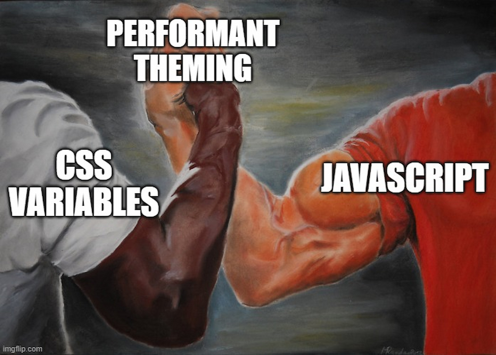

Theming in React is an enigma. You'll find a thousand articles on different ways of theming in React. Some suggest going full JavaScript, using the context API. Some suggest going full CSS with just CSS Variables. All these are really great approaches in some very fine articles. So why another article on this topic then?

This article aims to marry both the JS and CSS approaches into one single approach: **The performance of raw CSS, and the great Developer Experience of JavaScript 🔥**


# Elaboration

## CSS Variables method

This is how you would theme your site using just CSS variables

```css
body.light {
  --app-color-primary: blue;
  --app-color-primary-rgb: 0, 0, 255;
  --app-color-primary-contrast: white;

  --app-color-light: white;
  --app-color-light-rgb: 255, 255, 255;
  --app-color-light-contrast: black;

  --app-color-dark: black;
  --app-color-dark-rgb: 0, 0, 0;
  --app-color-dark-contrast: white;
}

body.dark {
  --app-color-primary: blue;
  --app-color-primary-rgb: 0, 0, 255;
  --app-color-primary-contrast: white;

  --app-color-light: black;
  --app-color-light-rgb: 0, 0, 0;
  --app-color-light-contrast: white;

  --app-color-dark: black;
  --app-color-dark-rgb: 0, 0, 0;
  --app-color-dark-contrast: white;
}
```

Theming using CSS variables is extremely fast. It's as if you're reaching into the internals of browser and manually repainting the DOM, without the tediousness that a process as complex as manually repainting requires. All you have to do is change the variables, and the whole page repaints itself extremely fast, totally jank-free.

But one drawback here is the fact that you have to remember these variables' names, because at the time of writing, VSCode doesn't autocomplete variables from other files, you're basically typing blind, without any support from the editor.

## React Context(AKA JS only approach)

The other way is using React Context to change themes, so you have a big JS object containing your colors:

```ts
const themes = {
  light: {
    primary: {
      main: 'blue',
      rgb: '0, 0, 255',
      contrast: 'white',
    },
    light: {
      main: 'white',
      rgb: '255, 255, 255',
      contrast: 'black',
    },
    dark: {
      main: 'black',
      rgb: '0, 0, 0',
      contrast: 'white',
    },
  },
  dark: {
    primary: {
      main: 'blue',
      rgb: '0, 0, 255',
      contrast: 'white',
    },
    light: {
      main: 'black',
      rgb: '0, 0, 0',
      contrast: 'white',
    },
    dark: {
      main: 'white',
      rgb: '255, 255, 255',
      contrast: 'black',
    },
  },
};
```

Then you basically put together Context and Providers, and have theme switching working. There's more boilerplate here, but the developer experience ultimately is really good. If you're using Context for theming, you're most probably using CSS-in-JS.

But the drawback here: Not-so-good User experience. JavaScript is a single threaded language. When you switch your theme, all components relying on the values will re-render, that is quite a bit of their DOM will be nuked and re-created with new values. Combine this with the fact that browser will try to relayout, and repaint at the same time as the re-rendering will be going on, this whole process can actually make the theme switching animation jankier: The user's mouse might stop moving, the animation itself won't happen in 60fps, elements might become un-interactive for a moment.

This can make the user experience feel suboptimal!

Summarising both approaches 👇


But it doesn't have to be this way! If you use CSS Variables and JavaScript in the right way, you can get blazing fast performance out of them, ans still have superb Developer experience.



# Setting up the CSS Variables

Let's set up the basic CSS variables first. These are just the ones defined in the **CSS Modules Elaboration** section above

```css
body.light {
  --app-color-primary: blue;
  --app-color-primary-rgb: 0, 0, 255;
  --app-color-primary-contrast: white;

  --app-color-light: white;
  --app-color-light-rgb: 255, 255, 255;
  --app-color-light-contrast: black;

  --app-color-dark: black;
  --app-color-dark-rgb: 0, 0, 0;
  --app-color-dark-contrast: white;
}

body.dark {
  --app-color-primary: blue;
  --app-color-primary-rgb: 0, 0, 255;
  --app-color-primary-contrast: white;

  --app-color-light: black;
  --app-color-light-rgb: 0, 0, 0;
  --app-color-light-contrast: white;

  --app-color-dark: black;
  --app-color-dark-rgb: 0, 0, 0;
  --app-color-dark-contrast: white;
}
```

> If this theming system's way of changing the `light` variable to a dark color feels counter-intuitive to you, you can create your own system too. I have personally used this theming system in half a dozen apps and it's extremely effective. Just my opinion 🙂

# Setting them up in a JS Object

Now, we'll do the same thing we did in the JS object, referencing colors, but this time we'll store the CSS Variable references here.

Create a separate `themes.js` or `themes.ts` file and put this in there

```ts
const theme = {
  colors: {
    primary: {
      main: 'var(--app-color-primary)',
      rgb: 'var(--app-color-primary-rgb)',
      contrast: 'var(--app-color-primary-contrast)',
    },
    light: {
      main: 'var(--app-color-light)',
      rgb: 'var(--app-color-light-rgb)',
      contrast: 'var(--app-color-light-contrast)',
    },
    dark: {
      main: 'var(--app-color-dark)',
      rgb: 'var(--app-color-dark-rgb)',
      contrast: 'var(--app-color-dark-light)',
    },
  },
};
```

> ATTENTION 🛑: Do not make this object in a component or context or anywhere! It has to be in a separate JavaScript object, entirely out of React's clutches.

# Putting into practice!

Now, here's the best part: Using our theme config JS variable!

Here's a demo of using it in 2 of very famous CSS in JS libraries

# No theme switching without a theme switcher, eh?
